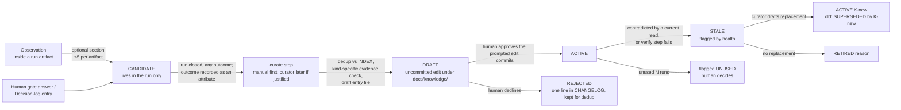

# Persistent knowledge layer — architecture investigation and proposed plan (revision 2)

**Status: INVESTIGATION DRAFT, revision 2, NOT APPROVED. Nothing implemented. This file is untracked in `docs/specs/` on the owner's instruction (copied there after revision 1); no other file in the repository was created or modified. No phase is authorized by this document. Owner disposition after independent review: DEFER PENDING BASELINE EVIDENCE — accept source-linked repository/team knowledge as a working hypothesis; authorize at most K0 (measurement guidance) separately; everything else remains a later, separate decision.**

- **Base:** `main` at `6356f9c` (post harness-alignment sequence; tracked files unchanged). Locked references `phase-1-reference` … `phase-5-reference` untouched.
- **Author / role:** Claude 5.1 as architect, 2026-09-14, on the owner's instruction to investigate and design, not implement. **Revision 2, 2026-09-14,** incorporates the owner-forwarded independent review (verdict DEFER PENDING BASELINE EVIDENCE; findings F1–F12); §27 records each point, what it was verified against, and what changed. Two host claims in the review were checked against current VS Code documentation before being applied (prompt-file `tools` precedence; edit-approval glob semantics).
- **Constraints honoured:** Copilot-native configuration-as-code only (no CLI, scripts, hooks, runtime, vector store, MCP server, schema registry); "keep the architecture, bounded forward improvements, measure before restructuring" (ChatGPT, 2026-09-11); no new agent, gate, STOP, artifact, tool, or permission without justification; the reference never stores corporate facts; publication only on the owner's explicit authorization.
- **Method:** primary-source research (Karpathy's gist and post; GitHub, Anthropic, OpenAI, Google documentation; the agent-memory literature) by three research subagents, each report kept with its URLs; a full read of the operating files, contracts, ledger, audit guidance, reviews, and examples; the design then argued against the repository as it is, not as the brief sketches it.

## 1. Executive summary

**Revision 2 disposition (read this first).** The independent review accepted the separation of repository/team knowledge from pipeline lessons, verify-on-read, no in-run writer, and preserved mode restrictions, and rejected the implementation sequence as premature: the proposal had not shown that this pipeline *needs* five entry kinds, six consumers, three skills, a curator, and a maintenance workflow, and several safeguards were overstated. Revision 2 therefore (a) reframes the missing capability as a **hypothesis** to be tested against baseline evidence (§6, §22); (b) replaces the single authority ranking with three domain rules (§9.1); (c) makes verification claim-specific (§9.2); (d) requires durable decision records and an immutable knowledge snapshot identity before any retrieval (§9.2, §10.1); (e) removes intake from the first trial and starts with the Planner only (§10.2); (f) corrects the tool-control description and defers the curator agent until manual curation has shown useful work (§11.3–11.4, §18); (g) counts total effort rather than citations (§20–21); (h) redesigns the experiment as a K0 baseline followed by a separately approved Planner-only source-map comparison (§22); (i) corrects phase semantics and file counts — K1 is a behavioural change, not a passive one (§23); and (j) recommends authorizing **K0 only** (§26). The architecture in §15 remains the candidate target if the evidence warrants it; nothing in it is authorized.

**The premise is half right.** The brief assumes the pipeline has no memory and asks whether to add one. The repository already has four of the five memory types the brief names: source of truth (target repositories, Jira, the `.github/` policy), episodic (twelve run artifacts with provenance, bases, decision log, iteration log), procedural lessons (Decision-log `lesson:` note → RUN-AUDIT's human path → `docs/HARNESS-LEDGER.md` → a reviewed change to a skill or contract), and working state (RUN.md). What it lacks is one thing: **curated, revision-pinned knowledge about the target repositories and the team's standing constraints**, with a read rule for the roles that rediscover it every run and a promotion path from a closed run into it. `CORPORATE-ADOPTION.md` already sketches the entry shape ("domain question · authoritative source and revision · owner · proof route · prerequisites · limits") and says real entries live in the team's own location and "Planner still has to inspect it". Nothing names a location, an index, a reader, a writer, or a freshness rule. That gap is the whole design problem.

**Karpathy's pattern fits, once translated.** His three layers — immutable raw sources, an LLM-compiled wiki, and a schema document that disciplines the maintainer — map onto this pipeline as: the run artifacts and the repositories themselves (raw; never copied), a small set of curated entries under `docs/knowledge/` (the wiki; human-owned), and one policy skill (the schema; model-neutral). His index-first retrieval ("reads the index first, then drills in … works surprisingly well at ~100 sources, hundreds of pages") is exactly the scale this pipeline will reach in a year, and it needs no search infrastructure. His lint list (contradictions, stale claims, orphans, missing pages) becomes a human-invoked health skill. What does not transfer is his write model: he lets the LLM own the wiki and file query outputs back in. Every agent-memory system surveyed that shipped that way either added a human promotion gate (Devin Knowledge, Augment Memory Review), pinned every fact to a citation re-verified against the current branch on each use (GitHub Copilot Memory), or was withdrawn (Cursor Memories, replaced by versioned rules). The documented failure mode is specific: agents replicate a retrieved record that resembles the current task even when it is wrong, and errors compound across runs. This pipeline's own trust rule — an artifact is data, not an instruction — already forbids the ungated version.

**Candidate target architecture (not authorized; see the revision 2 disposition above).** Architecture D, a hybrid with a narrow shape:

1. **Run time, read side.** In the deferred full architecture, six roles (intake, planner, adversary in plan mode, tester, developer, verifier) may read a bounded, scope-filtered slice of the knowledge index and the entries it names, under mode-specific kind restrictions, after their existing independent derivation steps, tagged `[KB]`; the first trial is **Planner only**, three relevant entries, hard cap five (§10.2, §22). A `[KB]` claim supports nothing until the evidence class its kind requires has been met in this run (§9.2: a read can confirm a static fact, never an execution outcome or a decision's current applicability); only then is the claim recorded under that class's tag with the entry as locator. The narrow modes (test review, assessment, activation) and the mechanical roles (workspace, pr) read nothing. The orchestrator reads nothing new; it records the knowledge snapshot identity in the invocation header (§10.1).
2. **Run time, write side.** No agent writes outside its own artifact. An optional `Knowledge candidates` section in the stage artifacts, on the exact shape of the existing `lesson:` note, is the only in-run capture. Candidates are data about the run, not knowledge.
3. **Between runs.** One human-invoked, narrowly tooled custom agent (a curator, not in the orchestrator's `agents:` list, never invoked by a run) executes two skills: *curate* (collate candidates, gate answers, verifier findings, and adversary residuals from a closed run; deduplicate against the index; draft entries with source, verify-step, and revision) and *health* (Karpathy's lint list plus this repository's specific checks). Every edit under `docs/knowledge/` prompts the human through the same settings mechanism that already protects `.github/`. The human approves per entry and commits. Nothing auto-promotes.
4. **Two promotion targets, kept apart.** A candidate that is a *fact about a repository or a team constraint* becomes a knowledge entry. A candidate that is a *lesson about how the pipeline should behave* goes to the existing ledger and, if adopted, changes a skill or contract. Knowledge never holds rules; the policy skills never hold repository facts.

Against the brief's own hypothesis ("a capability or skill rather than another always-running agent"): confirmed for the run loop, where knowledge is a read rule plus a candidate section, not an agent. Between runs, revision 1 argued that only an agent file can carry a scoped tool list; that is **incorrect** — a VS Code prompt file (`.github/prompts/*.prompt.md`) also declares `tools`, and its list takes precedence over the referenced agent's (§11.4). A tool-restricted writer can therefore be an agent *or* a prompt file, and either way the restriction is a tool list plus prose: the edit-approval glob prompts before a matching edit is applied and restricts nothing else. Revision 2 defers the curator entirely until manual curation has demonstrated work worth assisting.

**Why it might be worth doing, and what would stop it.** The hypothesis: (1) repository rediscovery for the same repositories across runs — intake's search and read budgets, the planner's evidence rows per repository, the tester's and verifier's runner detection — is *material* and a small source map could locate current sources faster; (2) human-stated constraints and repository-specific traps could be carried forward as *displayed, re-confirmable assumptions* at G3 instead of retyped G2 context. The budgets establish possible work, not measured waste; the pipeline has zero real runs. Revision 2 therefore asks for baseline measurement first (K0, §22) and treats every later phase as a separate decision; the kill criteria are total effort and independently judged relevance, not citation counts. Not proposed in any revision: a general memory of what agents concluded.

## 2. What Karpathy's knowledge-system idea actually is

Primary sources: Karpathy's post "LLM Knowledge Bases" (2026-04-02) and his gist `llm-wiki` (the elaborated "idea file"). The video (§2.3) is secondary.

### 2.1 The architecture, in his words

Three layers (gist):

- **Raw sources** — "your curated collection of source documents … These are immutable — the LLM reads from them but never modifies them. This is your source of truth."
- **The wiki** — "a directory of LLM-generated markdown files. Summaries, entity pages, concept pages, comparisons, an overview, a synthesis. The LLM owns this layer entirely … You read it; the LLM writes it."
- **The schema** — "a document (e.g. CLAUDE.md for Claude Code or AGENTS.md for Codex) that tells the LLM how the wiki is structured, what the conventions are, and what workflows to follow … it's what makes the LLM a disciplined wiki maintainer rather than a generic chatbot."

Directory names: `raw/`, `wiki/`, with two special files inside the wiki, `index.md` ("a catalog of everything in the wiki — each page listed with a link, a one-line summary … The LLM updates it on every ingest") and `log.md` ("chronological … an append-only record of what happened and when — ingests, queries, lint passes", with the convention `## [2026-04-02] ingest | Title` so it stays greppable). The wiki is a git repository: "version history, branching, and collaboration for free."

### 2.2 The operations

- **Ingest.** "You drop a new source into the raw collection and tell the LLM to process it … writes a summary page in the wiki, updates the index, updates relevant entity and concept pages across the wiki, and appends an entry to the log. A single source might touch 10–15 wiki pages." So the model updates existing pages rather than appending summaries, and cross-links as it goes. He prefers "one at a time and stay involved" over batch ingestion.
- **Query.** "The LLM searches for relevant pages, reads them, and synthesizes an answer with citations … good answers can be filed back into the wiki as new pages." That is the compounding loop: "my own explorations and queries always 'add up' in the knowledge base."
- **Lint.** "Periodically, ask the LLM to health-check the wiki. Look for: contradictions between pages, stale claims that newer sources have superseded, orphan pages with no inbound links, important concepts mentioned but lacking their own page, missing cross-references, data gaps." No cadence beyond "periodically".
- **Retrieval.** "When answering a query, the LLM reads the index first to find relevant pages, then drills into them. This works surprisingly well at moderate scale (~100 sources, ~hundreds of pages) and avoids the need for embedding-based RAG infrastructure." His own wiki was "~100 articles and ~400K words" and still fine. The optional escalation is `qmd`, a local hybrid BM25/vector search over Markdown with a CLI and an MCP server. He gives **no numeric cutover threshold**; secondary sources that quote one are extrapolating.

### 2.3 What is absent from the primary sources

- **Trust and hallucination.** Neither the post nor the gist says what LLM-generated pages should not be trusted for. The lint pass detects inconsistency; it is not a trust boundary. The Hacker News discussion of a Karpathy-style implementation identified precisely this: "the context that decays fastest is what agents wrote without a human glance … Does the promotion flow require human review or can agents self promote?" and "bad entries get cited by other agents, and that's how you end up with a knowledge base full of confident BS." That gap is what §11 of this document closes.
- **Provenance beyond citations.** Answers carry citations; pages do not carry a formal provenance record (source, revision, who approved). The video adds a "source provenance" audit; Karpathy does not.
- **Scale beyond one person.** The pattern is tuned for a single curator. Enterprise critiques (thousands of users, contradictory tribal knowledge) are secondary journalism, but the point stands: multi-writer conflict and authority are unaddressed.

### 2.4 The video, and what is the creator's rather than Karpathy's

"Build A Claude Knowledge Base That Self-Improves!" (Systems Made Better, 2026-05-23) reproduces the raw/wiki split, immutable sources, `CLAUDE.md` as schema, `index.md`, the one-line compile instruction, linting for contradictions and staleness, and filing answers back. It uses Claude Cowork (a desktop folder agent, not Claude Code) and adds, as the creator's own conventions: a formal `outputs/` folder; a multi-knowledge-base container; a 90-day staleness threshold; a packaged health-check skill on a monthly scheduled task with a seven-stage audit (contradictions, broken links, source provenance, raw coverage, staleness, suggested articles); a "librarian activity level"; and a style guide. The video also markets a paid template. None of those additions are in the primary sources; the ones worth keeping here (a packaged health skill; provenance as an audit stage) are adopted in §13 on their merits, not on the video's authority. The scheduled task is not adopted: the owner's rule forbids automation, and a health check that runs unattended produces a report nobody reads.

### 2.5 Translation to this pipeline

| Karpathy | This pipeline | Note |
|---|---|---|
| `raw/` immutable sources | The target repositories at a revision; the twelve run artifacts; Jira | Never copied into the reference. The "raw" layer already exists and is partly ephemeral (`.pipeline/` ignored). |
| `wiki/` LLM-owned compiled pages | `docs/knowledge/` human-owned curated entries | The ownership flips: the LLM drafts, the human owns. This is the single largest deviation and it is deliberate (§11). |
| schema (`CLAUDE.md`/`AGENTS.md`) | one policy skill, read by the curator; read rules in the consuming agents' Inputs | Model-neutral Markdown; Copilot reads it as a skill, Claude Code via a pointer, Codex via `AGENTS.md` (§21). |
| `index.md` | `docs/knowledge/INDEX.md`, one line per entry, revision line at top | The only file any run-time role reads first. |
| `log.md` | `docs/knowledge/CHANGELOG.md`, append-only, greppable | Mirrors the ledger's row history and RUN-AUDIT's "never delete history". |
| ingest | curate skill, run by a human after a closed run | Never automatic; never mid-run. |
| query, file answers back | run-time reads by the Planner in the first trial (six roles in the deferred full architecture); candidates from artifacts | Query outputs are the run's artifacts; they are filed back only as *candidates*. |
| lint | health skill, human-invoked before each batch review | Karpathy's list plus provenance, budget, and instruction-like-content checks. |
| `qmd` (BM25/vector) | not adopted; per-repository indexes first; `search/textSearch`/`search/codebase` already exist as tools | Escalation only on measured need (§23 phase K5). |

## 3. Relevant research and sources

Grouped by what each source contributes to the design. URLs are in the three research reports kept with this investigation; the most load-bearing are repeated here.

### 3.1 Vendor designs that constrain or validate the approach

- **GitHub Copilot Memory** (docs.github.com "About GitHub Copilot Memory"; engineering post "Building an agentic memory system for GitHub Copilot"; on by default for Pro/Pro+ since 2026-03-04). Repository-level facts ("coding conventions, architectural decisions, build commands, project-specific rules") plus user-level preferences. The design choice that matters most here: GitHub rejected offline curation in favour of **just-in-time verification** — "Repository facts are stored with citations pointing to the code that supports them … validates by checking those citations against the current branch … Only validated facts are used." Rationale in their words: "Information retrieval is an asymmetrical problem: it's hard to solve, but easy to verify." Unused facts are deleted after 28 days. Owners can review and delete repository facts; enterprise admins can export or delete. Scope: cloud agent, code review, CLI; facts are repository-scoped. **Implication:** the citation-plus-verify-on-read rule is the state of the art from the pipeline's own vendor and is adopted in §9/§10. **Caveat:** whether Copilot Memory reaches the corporate host's VS Code Local session is unverified (a new CA row, §19); it is vendor-specific and its store is not under the repository's version control, so it cannot be the model-independent substrate the brief requires. It is an adjacent capability to be assessed in the pilot, not the design.
- **Claude Code auto-memory** (code.claude.com "How Claude remembers your project"). Two tiers: human-authored, versioned `CLAUDE.md` (target under 200 lines; loaded wholesale; "context, not enforced configuration") and Claude-written notes under `~/.claude/projects/<project>/memory/` with a `MEMORY.md` index (first 200 lines or 25 KB loaded; topic files read on demand). Explicit exclusions: "skips anything it can derive from the codebase … skips anything your CLAUDE.md files already say." Auto-memory is not loaded into subagents. **Implication:** the index-first, on-demand pattern with a hard index cap; the exclusion rule ("never store what the repository already says") adopted as §20's link/summarize/never-store rule.
- **OpenAI Codex memories** ("Keep required team guidance in AGENTS.md or checked-in documentation. Treat memories as a helpful recall layer, not as the only source for rules that must always apply."; secrets redacted on write; review before sharing). **Implication:** rules stay in policy files; memory is recall. This is §5's conclusion that procedural lessons must not live in the knowledge layer.
- **Cursor Memories** were shipped in v1.0 (2025) and removed from v2.1, with users told to export memories into versioned Rules files. **Implication:** the one shipped unreviewed, unversioned memory feature in a major coding tool was withdrawn in favour of git-tracked, human-reviewed files.
- **Devin Knowledge** (suggest-then-approve: Devin proposes, the user edits or dismisses before saving) and **Augment Memory Review** ("see, edit, and curate memories as they're created") — the human promotion gate in production.
- **Aider `CONVENTIONS.md`** — the no-learning baseline: a human-authored, cached conventions file; no poisoning surface, no promotion problem. Worth naming because the pilot's control arm is effectively this.
- **Copilot customization surfaces** (docs.github.com): `.github/agents/*.agent.md` (`tools` restricts to a named subset; default is all tools; `user-invocable`, `disable-model-invocation`; body ≤ 30,000 characters); `.github/skills/<name>/SKILL.md` (`name`, `description`; progressive disclosure: metadata always, body on trigger, resources on demand); `.github/copilot-instructions.md`, `.github/instructions/*.instructions.md` with `applyTo`, `AGENTS.md`, `CLAUDE.md`, `GEMINI.md` all read; multiple instruction files are combined "without a guaranteed order"; `@path` imports supported in instruction files. VS Code lists `.github/agents` and `.github/skills` as workspace locations. **Implication:** the curator agent and the two skills are ordinary native assets; no new discovery configuration is needed.
- **Anthropic engineering** ("Effective context engineering for AI agents"; "Building effective agents"; "Writing tools for agents"; Agent Skills): progressive disclosure; a hybrid of up-front loading and just-in-time retrieval ("CLAUDE.md files are naively dropped into context up front, while primitives like glob and grep … retrieve files just-in-time, effectively bypassing the issues of stale indexing"); structured notes persisted outside the context window; sub-agents returning condensed summaries; "find the smallest set of high-signal tokens." Also the stance that Claude Code replaced an embeddings pipeline with agentic grep/glob/read for large codebases because a live repository drifts stale against an index. **Implication:** index-first plus read-at-path is the right retrieval for a small, fast-changing store; §10.
- **AGENTS.md** (agents.md, stewarded by the Agentic AI Foundation): schema-free Markdown, nearest file wins, read natively by Codex, Copilot, Cursor, Gemini CLI (via a configurable filename), and by Claude Code through `@AGENTS.md`. ChatGPT's addendum (2026-09-14) declined a root `AGENTS.md` here because it adds an always-on instruction surface with undefined assembly order. §22 keeps that decision and shows the knowledge layer needs no `AGENTS.md`.

### 3.2 Literature that names the failure modes

- **CoALA** (Sumers et al., 2023) — the working/episodic/semantic/procedural vocabulary this document uses.
- **"How Memory Management Impacts LLM Agents: An Empirical Study of Experience-Following Behavior"** (2025) — agents strongly replicate a retrieved record that resembles the current input; two measured failure modes, **error propagation** (stored inaccuracies compound) and **misaligned experience replay** (a past success is a misleading template for a superficially similar task). Proposed mitigation: use downstream outcomes as quality labels and prune memories whose reuse correlated with failure. **Implication:** §11's rule that candidates are extracted only from runs closed on `PASS`/G4 or explicit abort; §13's usage-and-outcome tally; §8's rule that entries describe observations and locations, never approaches.
- **Agentic Context Engineering** (2025) — two documented decay modes of memory-as-summary: **brevity bias** (rewriting drops detail) and **context collapse** (repeated rewriting erodes it). **Implication:** entries are atomic, one fact each, superseded rather than rewritten in place (§8, §13).
- **MINJA** (2025) and **AgentPoison** (NeurIPS 2024) — memory poisoning through ordinary queries and through retrieval triggers, with persistence across sessions; **OWASP ASI06 Memory & State Manipulation** and Microsoft's "Guarding AI memory" (sanitize on write; task-adherence checks; one successful write is enough for the attacker). **Implication:** §19's write-side controls: entries are data, instruction-like text is flagged, nothing verbatim from Jira or repository text, human approval per entry, prompted edits.
- **Reflexion, Voyager, ExpeL, Agent Workflow Memory, ReasoningBank, Memento, Agent KB, Dynamic Cheatsheet** — the evidence that experience reuse helps is real but comes from web/game/QA benchmarks and from *procedural* memory (workflows, code, strategies) more than from raw episodic replay; Voyager's skill library and AWM's induced workflows transferred, trajectories did not. The one SWE-bench-linked gain (Darwin Gödel Machine, 20 → 50%) came from an agent rewriting its own scaffold under sandboxing, a different and riskier mechanism. **Implication:** for this pipeline, procedural lessons should flow into the policy skills through the reviewed path (they are the "workflow memory"), and the knowledge layer should hold facts and locations, not strategies.
- **"When Does Memory Help? A Cost-Aware Evaluation"** (2026) — accuracy per token, not accuracy alone. **Implication:** §20/§21 measure discovery calls and tokens against citations; a layer that improves nothing measurable is retired.
- **Retrieval practice** — Anthropic (agentic grep beat embeddings on live codebases), Sourcegraph (moved from embeddings toward native code search), Cursor (still embeds, re-syncs every few minutes). **Implication:** at hundreds of entries, an index plus `search/textSearch` is adequate; escalation is a measured decision.

### 3.3 This repository's own prior analyses

- ChatGPT, 2026-09-11 efficiency review: keep the architecture; measure before restructuring; no new orchestration layer.
- ChatGPT, 2026-09-14 addendum §10: three lifecycles (versioned definition / individual run / reviewed learning); no root `AGENTS.md`, schemas, registries, global state files; a global writable record "would compete with run ownership, identity and freshness"; "a second map is worthwhile only when it indexes a distinct body of maintained knowledge"; real project context lives in the team's approved repository.
- Official-references review P1/P4/P6: an authority and knowledge map that links rather than copies; proof routes discoverable; lessons need a retirement path.
- RUN-AUDIT "From incident to reviewed lesson" and HARNESS-LEDGER: the lesson lifecycle, validation levels, privacy rule.
- CORPORATE-ADOPTION "Team context and proof-route entries": the entry shape; "Planner still has to inspect it."

These are the constraints §4 turns into design rules, and this document is written to be reconciled against them with the same six questions the harness proposal's §9 applies to any further analysis.
## 4. Current pipeline architecture

### 4.1 The corrected model

The brief's sketch (Human → Orchestrator → Planner → Human review → Developer → Tester → Auditor → Human) is close but wrong in four places that matter for a knowledge layer: the adversary reviews the **plan** *before* any test exists and reviews the **test contract** again *before* any implementation exists; the tester runs *before* the developer (RED first); verification is a separate mechanical role, not the adversary; and every human interaction goes through the orchestrator, because stage agents are stateless subagents that cannot ask questions.

```text
Human ── /pipeline KEY[, KEY…] ──► pipeline (orchestrator; owns RUN.md; only agent that talks to the human)
                                    │
  stage 1   intake ──────────────► INTAKE.md            ◄─ Jira (MCP, read-only) + workspace listing
  gates     G1 repositories, G2 branch + developer context   (human, recorded in RUN.md with basis + CURRENT/STALE)
  stage 2   workspace ───────────► WORKSPACE.md         (git prepare; terminal; never reads INTAKE.md)
  stage 3   planner ─────────────► PLAN.md  cycle.round  ◄─ plan-grounding skill, INTAKE, RUN, code (read-only)
  stage 4   adversary (plan mode) ► ADVERSARY-REVIEW.md ◄─ plan-grounding + challenge-plan; APPROVE/REVISE/BLOCK, ≤2 rounds/cycle
  gate      G3 plan approval  (APPROVE / SEND_BACK → new planning cycle / ABORT)
  stage 5   tester ──────────────► tests (committed), TEST-CONTRACT.md, RED-REPORT.md   ◄─ test-contract skill, PLAN only
  stage 5b  adversary (test-review mode) ► TEST-REVIEW.md   ACCEPT / REVISE (≤1 automatic correction round)
  stage 6   developer ───────────► code (committed), IMPLEMENTATION.md   ◄─ implementation-quality skill; bounded allowance 6/6/2
  stage 7   verifier ────────────► VERIFICATION.md   PASS / INCOMPLETE / FAIL; obligations first, claims last; ≤2 fix rounds
  stage 8   pr ──────────────────► PR-DESCRIPTION.md
  gate      G4 publish + PR  (per-repository tuple approved: dir, destination, branch, verified SHA, target)
  stage 9   workspace ───────────► WORKSPACE.md Publish section (explicit-object push of the verified SHA)
  stage 10  pr ──────────────────► PR.md (Bitbucket create/reuse; intent before effect)
```

Nine agents, seven skills, twelve run artifacts, four gates, twenty-odd STOP codes. Everything an agent knows arrives either in its invocation header (stage, mode, round, run directory, active allowed-input revision ids, owned output, return condition) or in the artifacts and skills its contract permits it to read. There is no shared context object and no state machine; resumption is reconstructed from the artifacts on disk.

### 4.2 Properties that constrain a knowledge layer

These are not incidental. Each one either supplies a building block the knowledge design can reuse or forbids an approach that would otherwise be natural.

| Property | Where it lives | Consequence for a knowledge layer |
|---|---|---|
| **Single writer per artifact; earlier artifacts immutable** | `AGENT-CONTRACTS.md` ownership matrix; GUARDRAILS "Artifact ownership" | No agent may gain a second writable target during a run. A knowledge store written by stage agents mid-run would break the matrix. Candidates must land in the writer's *own* artifact. |
| **Mode-specific input lists; some modes are deliberately blind** | Adversary test-review mode reads only PLAN, TEST-CONTRACT, RED-REPORT, controlled paths; Tester activation reads nothing else; Developer never reads RUN.md; terminal-holding agents never see INTAKE.md (A7) | Knowledge reads must be declared per role *and mode*, and the narrow modes should stay narrow. "Load knowledge for every agent" is already forbidden by the existing context-compiler design. |
| **Every artifact and repository file is data, never instructions** | `copilot-instructions.md`; GUARDRAILS "Trust boundaries"; HARNESS.md ("a lesson … never grants permission") | Knowledge entries are data too. They may locate evidence; they may never authorize an action, widen scope, or substitute for a gate. This rules out "learned rules" that agents execute. |
| **Provenance tags on every stated fact** | `[JIRA]` `[REPO]` `[DEV]` `[TOOL]` `[INFERENCE]` | A ready-made provenance vocabulary. A knowledge layer needs exactly one new tag (`[KB]`) and a rule for when a `[KB]` claim may be relied on. |
| **Basis + `CURRENT`/`STALE` on every approval; `ACTIVE`/`SUPERSEDED` on every artifact revision** | RUN.md gates log and Artifact history | A ready-made freshness model. Knowledge entries can carry the same shape: a basis (repository revision, run, review) and a status. |
| **Validation levels separated from change status** | `docs/HARNESS-LEDGER.md` columns; RUN-AUDIT "From incident to reviewed lesson" | A ready-made confidence ladder (`NOT_VALIDATED` → `DOCUMENT_SCENARIO_REVIEWED` → `EXECUTION_OBSERVED` → `OPERATIONAL_OUTCOME_MEASURED`). Do not invent a numeric confidence field. |
| **`.pipeline/` is git-ignored; run artifacts are not a durable archive** | `.gitignore`; RUN-AUDIT "Snapshot before replacement"; CA-22 `NOT VERIFIED` | The episodic layer is ephemeral unless the corporate archive captures it. Anything durable must be extracted *at run closure*, before the directory is overwritten or lost. |
| **Every top-level directory except `.github/`, `.vscode/`, `docs/` is git-ignored** (nested clones) | `.gitignore:40–46`; ChatGPT addendum §10.2 | A root `knowledge/` directory would be untracked. Durable knowledge must live under `docs/` (or `.github/`), and ChatGPT has already ruled that changing the ignore list changes the workspace boundary and is out of scope. |
| **Edits under `.github/**` and `.vscode/**` always prompt** | `.vscode/settings.json` `chat.tools.edits.autoApprove` | The repository's only mechanical write control is a settings rule. The same mechanism can protect the knowledge directory: one added `false` glob makes every agent edit there prompt the human. |
| **Copilot-native configuration only; no scripts, hooks, runtimes, schemas, registries** | Owner rule (2026-09-09); ChatGPT addendum §10.3 | Health checks, ingestion, and retrieval must be agents, skills, Markdown, and existing tools. No BM25 service, no vector store, no MCP server, no cron. |
| **"Measure before restructuring"; no new agent, gate, STOP, artifact, or tool without justification** | ChatGPT efficiency review; harness proposal §4 "Explicitly not proposed" | The bar for adding a curator agent is high and must be argued, not assumed. |
| **Zero real runs so far** | CORPORATE-ADOPTION: all 22 CA rows `NOT VERIFIED`; examples are fictional | Every claim about what a knowledge layer would save is a hypothesis. The reference can ship the *design*; the value test belongs to the owner-led corporate pilot. |
| **Two lifecycles for learning already exist** | Decision-log `lesson:` note (in-run, optional) → human generalization → `docs/HARNESS-LEDGER.md` (reference lessons); `CORPORATE-ADOPTION.md` team setup record and proof-route entry shape (team knowledge, kept in the team's own location) | The repository already distinguishes *lessons about the pipeline* from *knowledge about the target repositories and team*. A knowledge layer must slot into both without creating a third, competing record. |

### 4.3 What an agent actually reads today (context baseline)

Approximate sizes of the operating text, by word count (multiply by ~1.35 for tokens):

| Invocation | Policy text read | Typical artifacts read |
|---|---|---|
| pipeline (every stage transition) | its own body 6.2k words | RUN.md (1.0k SMALL / 2.2k LARGE) + the returned artifact |
| intake | body 1.3k + gather-jira-context 1.2k + discover-affected-projects 1.0k | Jira payloads, README heads (≤60 lines × repositories), build-file names |
| planner | body 1.6k + plan-grounding 2.3k | INTAKE.md (0.3k–1k), RUN.md, repository code (unbounded, read-only) |
| adversary (plan) | body 2.6k + plan-grounding 2.3k + challenge-plan 1.6k | PLAN.md (0.7k–3.6k), INTAKE.md, RUN.md, code |
| tester | body 4.4k + test-contract 5.1k | PLAN.md, code, test directories |
| adversary (test-review) | body 2.6k + test-contract 5.1k | PLAN.md, TEST-CONTRACT.md (0.8k–5.0k), RED-REPORT.md (0.9k–3.1k), controlled paths |
| developer | body 2.9k + implementation-quality 5.3k | PLAN.md, TEST-CONTRACT.md, RED-REPORT.md, WORKSPACE.md (baseline only), code |
| verifier | body 3.9k + implementation-quality 5.3k | seven artifacts + RUN.md + full patch |

Policy already costs 7–10k words per invocation of the heavy roles. A knowledge read that adds more than a few hundred words per invocation without removing repository searches is a net loss; that sets the budget in §20.

## 5. Current memory and knowledge capabilities

Measured against the five memory types the brief asks for, the repository already has four of them in some form. The gap is narrower than the brief assumes.

| Memory type | Exists today? | Where | Lifetime | Writer | Reader | Gap |
|---|---|---|---|---|---|---|
| **A. Source of truth** | Yes | Target repositories (code, tests, build files); Jira (requirements); `.github/` policy and contracts (workflow authority); team ADRs/docs (outside this reference) | As long as the source | Their owners | Every role per its Inputs | None. Nothing is copied; HARNESS.md's authority model already distinguishes workflow authority, task evidence, and historical material. |
| **B. Semantic (reusable conclusions about the *target* repositories and team)** | **Shape only** | `CORPORATE-ADOPTION.md` "Team context and proof-route entries" (domain question · authoritative source and revision · owner · proof route · prerequisites · limits) and the "team setup record" checklist | Undefined | "the team", by hand | "Planner still has to inspect it" — no role names it as an input | **This is the gap.** No location, no index, no read rule, no write rule, no promotion path, no freshness rule, no fictional example. |
| **C. Episodic (what happened in a run)** | Yes, richly | The twelve run artifacts: evidence rows, `cycle.round` history, gates log with basis, Decision log (STOP decisions, exceptions, restorations, reconciliations, delivery continuations, optional `lesson:` note), IMPLEMENTATION.md Iteration log with hypothesis/observation/result, VERIFICATION.md Prior findings | One run; `.pipeline/` ignored; durable only if the corporate archive captures it (CA-22) | Each stage's owner | `pipeline` (all), later stages per matrix | Ephemeral; no cross-run digest; nothing reads a *previous* run. That is by design (a completed prior run must not be mistaken for validating a later plan — COMPARISON-GUIDE). |
| **D. Learned heuristics (procedural lessons about how the pipeline should behave)** | Yes | Decision-log `lesson:`/`lesson class:` note → RUN-AUDIT "From incident to reviewed lesson" → `docs/HARNESS-LEDGER.md` (five rows) → a *change to the operative source* (skill, agent, contract) with a validation level | Reference lifetime; retired through owner review | Human only; never during a run | Humans; **explicitly not an agent input** | Complete for its purpose. Heuristics become rules in the policy skills, which agents already read. They should *not* also be stored as run-time knowledge. |
| **E. Temporary working state** | Yes | RUN.md Stage status, Artifact history, Resume notes with the derived `Summary` block; IMPLEMENTATION.md reservations; WORKSPACE.md/PR.md intent-before-effect | One run | Owners | `pipeline` on resume | None. |

Two conclusions follow, with the qualification the independent review asked for.

1. **The candidate missing memory type is B**: curated, revision-pinned knowledge about the target repositories and the team's constraints, with a read rule for the roles that rediscover it every run and a promotion path from C into B. Everything else in the brief's RAW → EXPERIENCE → KNOWLEDGE picture already exists under other names — **as specification, at the validation level each carries**. The ledger's changed rows are `DOCUMENT_SCENARIO_REVIEWED`, not observed in a corporate run; the optional run-to-ledger path has never been executed on a real run; episodic records exist but their durable retention is unresolved (CA-22). "Exists" therefore means "is specified and has produced reviewed changes", not "is proven to work operationally". Whether type B is the *material* gap, rather than retention or operational learning, is the hypothesis §22's baseline is designed to test.
2. **Type D stays where it is.** A heuristic such as "changes touching shared orchestration and agent contracts should be split into separate slices" is a *policy* matter for `plan-grounding` or `challenge-plan`, promoted through the ledger with a validation level, reviewed, and committed. It need not become a universal operating rule: after review it may remain an advisory ledger lesson, or become a narrowly applicable example inside an existing skill. Putting it in a run-time knowledge base instead would create the second source of truth the brief forbids, would make agents "cite conclusions produced by previous agents" as if they were rules, and would bypass the reviewed-change path the repository has spent five phases building.

## 6. Problems a persistent knowledge layer could solve

Assessed against what the current files show, not against the brief's list as given. Only items with evidence in the repository are marked "real here".

| Candidate problem | Real here? | Evidence in the repository | What knowledge would change |
|---|---|---|---|
| Repeated rediscovery of repository conventions | **Real, by construction** | Intake spends up to 12 text searches and 20 file reads per run to recommend repositories from README heads and build-file names; Planner writes ~12 evidence rows per repository with a "Searched:" line; Tester and Verifier each "detect the runner from build files" every run; Tester classifies the execution envelope and relied-on tests from scratch | A per-repository entry (runner commands, test layout, proof routes, proof-relevant envelope files, known relied-on tests, component owners) turns a search into a *verify-at-path* read. The existing rule "a search locates candidates; a current file read establishes the content cited" is preserved: the entry says where to look, the read still happens. |
| Human corrections not becoming reusable | **Real** | G2 developer context in the LARGE example ("Keep the retry backoff config in application.yml"; "Ledger team asked that retry attempts write to the existing audit_log table") is typed per run; a G3 `SEND_BACK` records per-choice `[DEV]` answers that vanish with the run | A `TEAM_CONSTRAINT` entry sourced `[DEV]` from a gate answer, surfaced to the Planner as an `ASSUMED`/`G3` row with a `[KB]` basis, so the human sees it at G3 and re-confirms rather than retyping. Human authority is preserved because the entry becomes a *displayed assumption*, never a silent input. |
| Auditor findings not influencing future planning | **Partly real** | Adversary residual findings (RK2 lockstep retries without jitter) are accepted per run and forgotten; Verifier findings (hard-coded base delay while tests pass) are recorded in Prior findings of that run only | Repository-scoped `KNOWN_TRAP` and `OPEN_RISK` entries the adversary and verifier read *after* their independent derivation. Cross-run generalizations of the finding class ("configuration read at construction time is not observed by tests") belong to the challenge catalogue via the ledger, not to knowledge. |
| Implementation failures forgotten | Partly real | IMPLEMENTATION.md Iteration log records hypothesis/observation/result, then the run ends | Only the *repository-specific* residue is worth keeping (a build quirk, a fixture that must be isolated per test, a flaky identity). The rest is noise; keeping every iteration would be the "endless summaries" Karpathy warns against. |
| Planning lessons lost | Partly real | Plan quality lessons (F1–F3 in reviews) already flow to `plan-grounding` via the ledger | No new mechanism; ledger works. |
| Architecture knowledge scattered | Not the reference's problem | HARNESS.md is the map; application architecture belongs to the team's own docs (ChatGPT addendum: "actual application architecture and proof routes belong in the target team's approved repository") | The knowledge layer *links* to those documents (source + revision); it never summarizes them. |
| Duplicated context supplied to agents | Real but different | N1-class normative repetition across agent bodies, contracts, and skills (accepted debt; "measure prompt size before restructuring") | Not a knowledge problem. A knowledge layer must not add to it. |
| Context-window waste | Unmeasured | No host usage figures exist | Only measurable in the pilot (CA-21). The knowledge layer's own read must be bounded so it cannot make this worse. |
| Repeated mistakes between runs | Unmeasured | Zero real runs | Hypothesis; the smallest experiment (§22) is designed to test exactly this. |

**Net assessment (revision 2).** "Real, by construction" in the table above means the *work is specified*: search budgets and evidence rules establish possible work, not measured waste. The layer is a **hypothesis** with exactly two candidate purposes: (1) cutting repository rediscovery for the same repositories across runs, and (2) carrying human-stated constraints and repository-specific traps forward as *displayed, re-confirmable assumptions*. It is not proposed as a general memory of "what agents concluded", nor as a second home for procedural lessons. Before any entry kind, consumer, or store is authorized, a baseline (§22) must show a recurring navigation or constraint problem, current sources a small map could locate, and measured discovery and human effort. Where authoritative team documentation already exists, improving its discoverability comes before duplicating its content. If the baseline shows discovery cost is small, the layer is not built.

## 7. Risks and failure modes

A critical assessment first; the tabulated failure modes with detection and mitigation are in §7.2.

### 7.1 Why this could make the pipeline worse

- **It is a new always-available input into roles whose value depends on independence.** The adversary's worth comes from deriving requirements from INTAKE.md *before* reading PLAN.md. If planner and adversary both read the same knowledge entries first, they share the entry's blind spot. Mitigation is ordering (knowledge after independent derivation) and kind restriction (adversary reads traps and risks, not proof routes), but the risk cannot be removed, only bounded.
- **Human-approved is not the same as true.** The ledger's own rule — a commit proves a change happened, not that the weakness was corrected — applies. An `ACTIVE` entry approved on repository revision X can be false at revision Y. Every entry therefore needs a *verify step* executable with read-only tools, and every use needs a current read.
- **It converts the human's per-run context into a default.** That is the point, and also the danger: a constraint the ledger team asked for in March may be withdrawn in June. Surfacing entries as displayed assumptions at G3 keeps the decision human, but the human will click through. The mitigation is proportional: only `TEAM_CONSTRAINT` entries are displayed, and each carries its last confirmation.
- **Token cost is certain; benefit is hypothetical.** The heavy roles already read 7–10k words of policy. An index read plus a handful of entries adds 300–800 words; if those entries do not replace searches, the pipeline is slower and not better. §20 fixes a budget and §21 the measure that decides whether to keep the layer.
- **Corporate contamination of the public reference.** The reference must never contain corporate repository names, paths, ticket keys, or facts. The knowledge layer's *entries* are exactly that kind of content. The design therefore ships shape, rules, and a fictional example only; real entries live in the team's adopted workspace-root repository.

### 7.2 Failure-mode table

| # | Failure | Cause | Impact | Detection | Mitigation |
|---|---|---|---|---|---|
| 1 | Knowledge poisoning | Instruction-like or false content enters an entry (from Jira text, a repository file, a hallucinated candidate, or a malicious PR) and is approved | Agents locate the wrong evidence or, worse, treat text as an instruction | Health check flags instruction-like sentences (the existing "Suspicious content" rule applied to entries); every entry must cite a `[REPO]`/`[DEV]`/`[TOOL]` source; `[INFERENCE]`-only entries can never be `ACTIVE` | Entries are data (trust boundary extended by one sentence); human approval per entry; edits under the knowledge directory always prompt; verbatim Jira/comment text never stored, only pointers |
| 2 | Stale knowledge | Repository refactored; team constraint withdrawn; proof route removed | Planner cites a path that no longer exists; tester runs a stale command | Entry `verify:` step fails on read (path/symbol absent); `verified_at` revision far behind current baseline; health report | Read rule: a `[KB]` claim supports nothing until a current read confirms it; on mismatch the planner writes a `NOT_FOUND`/`CONTRADICTED` evidence row and routes by R6; curator marks `STALE`; retirement path |
| 3 | Hallucination reinforcement | An agent's inference becomes a candidate, is approved without checking, then read by the next run as `[KB]` | Confidently wrong plans that cite "knowledge" | Provenance chain: every `ACTIVE` entry names a non-inference source; health check lists entries whose only evidence is another entry or a run artifact | Candidates carry the producing agent and the artifact locator; the curator drafts, the human approves; `[KB]` never upgrades to `[REPO]` without a read |
| 4 | Authority confusion | An entry contradicts current code, a contract, or a gate answer | Agent follows the entry | Contradiction surfaces as an evidence row; verifier obligation check derives from PLAN/RUN, never from knowledge | §9.1's three domains, not a ranking: current source and attributable execution evidence establish *current behaviour*; requirements, authorized decisions, and the approved plan establish *required behaviour*; policy and applicable approvals govern *permitted actions*. An entry is historical context in each domain; a conflict is disclosed through the existing decision routes |
| 5 | Duplication | Same fact recorded twice with different wording; entry restates a README or ADR | Growth; conflicting updates | Health check (same scope + similar statement); entries that exceed a length cap are suspect | "Link, don't summarize" rule (§20); one entry per fact; supersession instead of edit-in-place |
| 6 | Context overload | Index grows; agents load whole directory | Slower, costlier runs; policy text crowded out | Per-invocation knowledge budget recorded in the artifact `inputs:` line; health check reports index size | Index-first; scope filter by confirmed repositories; kind filter per role/mode; hard cap on entries loaded; per-repository indexes when the global index passes ~150 lines |
| 7 | Over-engineering | Building raw stores, schemas, vector search, a curator loop before any run exists | Maintenance burden; second runtime by stealth | Phase gates in §23 require measured evidence to proceed | K0 is measurement documentation only; K1 already changes six agents' generation behaviour; K2 adds between-run capabilities and approval configuration; K3 changes runtime retrieval and evidence handling; each is a separate decision, and only K0 is proposed now |
| 8 | Bias toward old solutions | `KNOWN_TRAP`/`PROOF_ROUTE` entries freeze one implementation strategy | Legitimate alternatives blocked (P4: "do not freeze one implementation strategy as mandatory") | Verifier NOTE-class findings citing knowledge; planner Q rows that only restate an entry | Entries describe *observations and where to look*, never prescribe an approach; the verifier's obligation list is derived from PLAN/RUN, never from knowledge |
| 9 | Project contamination | Knowledge from one team's workspace copied into the reference or another workspace | Corporate facts leak; wrong constraints applied elsewhere | Reference CI-free check: the reference's `docs/knowledge/` contains only the fictional example; privacy rule as in the ledger | Knowledge is per workspace-root repository, never global; the reference ships shape and example only; no cross-workspace import path exists |
| 10 | Runaway growth | Every run adds entries; nothing retires | Index unusable; retrieval precision falls | Health report: unused entries (no citation in N runs), count per repository | Candidates are opt-in per artifact; the curator dedups against the index; retirement and supersession are first-class; a length cap per entry |
| 11 | Excessive human review | Every candidate needs approval | Curation cost exceeds savings; approvals become rubber stamps | Curation minutes tracked in the scorecard; promotion acceptance rate | Proportional approval (§12): `REPO_FACT` with a passing verify step may be *batched* for approval; `TEAM_CONSTRAINT` and `KNOWN_TRAP` always individually; nothing auto-promotes |
| 12 | Incorrect promotion | A candidate is drafted from a superseded plan revision, or an entry inherits a run's overall outcome as if it were evidence for the entry | False knowledge; or valid failure evidence discarded | Candidate carries its own evidence locator and the run outcome as a *separate attribute*; the curator assesses each candidate's evidence on its own merits (a `FAIL`ed run can contain a reproducible, valid trap; a `PASS` run can contain a wrong observation) | Extraction reads ACTIVE artifacts and the gates/Decision log; superseded revisions are never a source; run outcome never substitutes for candidate-level evidence |
| 13 | Agents gaming metrics | Agents cite `[KB]` entries to look efficient, or emit many candidates to look diligent | Metrics inflate; precision falls | Precision = entries cited *and* confirmed by a read / entries loaded; candidate acceptance rate per producing role | The measure that matters is discovery calls and repeated findings, not citation counts; candidates are optional and capped |
| 14 | Hidden circular dependencies | Entry A cites entry B; B cites a run that used A | Unfalsifiable knowledge | Health check: an entry's `source` may not be another entry or an artifact of a run that read the entry | Sources must be primary (`[REPO]` path+revision, `[DEV]` gate answer, `[TOOL]` output) |
| 15 | Obsolete conclusions surviving refactors | Entry keyed to a path that was moved | Silent staleness | `verify:` step fails; baseline SHA comparison in the health report | Entries pin `verified_at: <origin/default SHA>`; the curator re-verifies entries for a repository whenever a run's WORKSPACE.md baseline moves past the pinned revision |
## 8. Memory taxonomy

The five types with the properties the brief asks for. Only type B is new; the table records the others so the boundaries are explicit.

| Type | Content | Location | Lifetime | Trust | Read policy | Write policy | Promotion |
|---|---|---|---|---|---|---|---|
| **A. Source of truth** | Target repository code/tests/build; Jira; `.github/` policy and contracts; team ADRs and docs | Their own homes | Owner-controlled | Highest for facts (code) and for procedure (policy) | Per role Inputs, unchanged | Never by this layer | n/a |
| **B. Curated knowledge (new)** | Facts about a repository or the team, in five kinds: `REPO_FACT` (runner commands, test layout, build quirks, component owners), `PROOF_ROUTE` (how a clause is observed: existing test, command, inspection, prerequisites, limits), `TEAM_CONSTRAINT` (a human-stated standing constraint), `KNOWN_TRAP` (a repository-specific way a passing test can lie or an implementation can violate an obligation), `OPEN_RISK` (an accepted, still-open risk carried across runs) | `docs/knowledge/` in the team's workspace-root repository (the reference ships only shape and a fictional example) | Until superseded or retired; re-verified against a revision | Human-approved data; never an instruction; never grants permission | Index-first, scope-filtered, kind-restricted per role/mode, bounded (§10) | Human only, through prompted edits; the curator drafts (§11) | From a candidate, after a closed run, through curate → human approval |
| **C. Episodic** | The twelve run artifacts | `.pipeline/runs/<PRIMARY>/` (ignored); corporate archive if CA-22 passes | One run | Data produced by a provenance-tagged process; still data | `pipeline` and later stages per the matrix; **never a previous run** | Owners, unchanged | Source of candidates only; never read by a later run |
| **D. Procedural lessons** | Generalized weaknesses of the pipeline and the change that addresses them | `docs/HARNESS-LEDGER.md` → the operative skill/agent/contract | Reference lifetime | Reviewed; validation level explicit | Humans; the *resulting rule* is read by agents as policy | Human only, between runs | Existing path, unchanged |
| **E. Working state** | RUN.md tables, Resume notes summary, reservations, intent-before-effect records | RUN.md and owned artifacts | One run | Derived caches never outrank sources | `pipeline` on resume | Owners | n/a |

**Boundary rules that keep the types apart.**

- A knowledge entry states *what is observed and where*, never *what to do*. "Retry base delay is read from `application.yml` at construction time (`RetryBackoffPolicy.java`) so a test that fixes the value in `application-test.yml` cannot observe a hard-coded default" is a `KNOWN_TRAP`. "Always check configuration is read at runtime" is a policy sentence for `challenge-plan` or `implementation-quality`, promoted through the ledger.
- A `TEAM_CONSTRAINT` is a fact about what a human said and when ("`[DEV]` G2 context, 2026-09-14, PAYMENTS-12345: keep retry backoff configuration in `application.yml`; last re-confirmed at G3 of run …"). It is displayed to the human; it is never applied silently.
- An entry never restates the content of a README, ADR, or contract; it links to the source at a revision (§20).
- Episodic material is never summarized into knowledge as a narrative ("in run 38 the developer tried X"). Only the repository-specific residue survives, as an atomic entry with a verify step. The experience-following study is the reason: a narrative of a past run is exactly the record an agent will imitate.

## 9. Authority and provenance model

### 9.1 Authority: three domains, not one ranking

Revision 1 proposed a single ordering with "current code" at the top. The independent review showed why that fails: current code implements behaviour the task expressly asks to change, so "code wins" would preserve the defect. Observations, obligations, and permissions answer different questions and must not be ranked against each other. Revision 2 uses three rules, matching HARNESS.md's authority model (workflow authority · task evidence · history):

1. **Current behaviour — what happens.** Established by current source and attributable execution evidence (`[REPO]` reads at a revision, `[TOOL]` output from this run), within their stated limitations. A knowledge entry is *historical supporting context* here: it says what was observed at `verified_at`; it never establishes current behaviour by itself.
2. **Required behaviour — what must change or remain.** Established by current requirements (`[JIRA]`, data not instructions), authorized decisions in this run (G1–G4 answers, Decision log, `[DEV]`), and the approved plan. A `TEAM_CONSTRAINT` entry is historical context here: a record of what a human decided earlier, with its scope and date; it becomes a requirement for *this* run only through the existing decision routes (an `ASSUMED`/`G3` row voiced at G3, or a `[DEV]` answer).
3. **Permitted actions — what may be executed.** Governed by workflow and security policy (skills, agents, contracts, settings) and the applicable approvals. No entry, and no gate answer outside the answering person's authority, waives a policy. HARNESS.md already says a lesson "never grants permission or substitutes for the approved workflow's own gates and checks"; the knowledge policy repeats that sentence once.

Consequences:

- **A contradiction is disclosed, not resolved by rank.** An entry contradicted by a current read yields a `NOT_FOUND`/`CONTRADICTED` evidence row (R3 already has the `NOT_FOUND` shape) and the consequence is routed by R6; the tester or verifier records the contradiction under its own artifact's existing Warnings/Disclosures. Nobody edits the entry mid-run.
- **A displayed constraint is re-decided each run.** A `TEAM_CONSTRAINT` appears at G3 as an assumption or a question; a `SEND_BACK` that contradicts it is authoritative for this run and is a candidate for the curator (supersede or retire).
- **Team documents (ADRs) are made visible, not ranked.** The entry's job is to surface the ADR as a Q row so the human decides with it in view.

### 9.2 Provenance: the smallest useful schema

Every entry is one Markdown file with a fenced YAML header, the same convention as the run artifacts, and a body of at most ~40 lines.

```yaml
id: K-0012
kind: REPO_FACT | PROOF_ROUTE | TEAM_CONSTRAINT | KNOWN_TRAP | OPEN_RISK
scope: payments-api            # one repository directory name, or TEAM
statement: one sentence, ≤ 200 characters, observation not instruction
source:                        # at least one non-INFERENCE line; the primary evidence
  - "[REPO] payments-api/src/main/java/.../RetryBackoffPolicy.java:41 @ 9f8e7d6"
  - "[DEV] G2 context, PAYMENTS-12345 (2026-09-14)"
verify: read payments-api/src/main/java/.../RetryBackoffPolicy.java and confirm the base delay is read from configuration   # a read-only step the curator or a role can execute
verified_at: 9f8e7d6           # origin/<default> SHA of the scope repository when last confirmed; or a date for TEAM
status: ACTIVE | SUPERSEDED by K-0031 | RETIRED (reason)
approved: "[DEV] 2026-09-20"   # the human who approved and when; no corporate identifiers beyond what the team's private policy allows
decision_record: <link to the team's approved decision/source record>   # required for TEAM_CONSTRAINT and OPEN_RISK; see "Durability" below
```

**Verification must match the claim.** A file read confirms static facts; it does not convert every claim into `[REPO]`. Revision 1's rule "a `[KB]` claim becomes `[REPO]` after a read" was too broad. The rule by kind:

| Entry kind | What a current read or record can establish | What it cannot establish |
|---|---|---|
| `REPO_FACT` | A path, symbol, configuration value, or bounded static behaviour exists as stated at the current revision | That a command succeeds, that a build passes, or any execution outcome — a configured test command is not evidence that the tests pass |
| `PROOF_ROUTE` | That the route exists (test file, command, inspection target) and what its assertions observe | That it executes successfully now (needs attributable current execution evidence, `[TOOL]`, from this run) or that it proves the clause (needs the tester's/adversary's adequacy judgement under T3/T8/T11) |
| `TEAM_CONSTRAINT` | Who decided what, with what scope, when — from the linked decision record | Current applicability — needs the same authority or fresh confirmation at G3; `[DEV]` provenance is preserved, never rewritten as `[REPO]` |
| `KNOWN_TRAP` | The mechanism, confirmed through the relevant source; where the trap is behavioural, reproducible execution evidence | Anything from an anecdote alone |
| `OPEN_RISK` | That the technical risk still exists (source inspection) | That accepting it is authorized for this task — a previous acceptance is history, not permission |

A retained `[TOOL]` result inside an entry or a linked record remains **historical** evidence, with its revision, command, environment, and limits; reading the file that contains it does not make it a newly executed result. The `[KB]` tag therefore stays on the claim until the claim's own evidence class is met; only then is the claim recorded under the tag that evidence class carries (`[REPO]` for a confirmed static fact, `[TOOL]` for an execution performed in this run, `[DEV]` for a decision), with the entry id as locator.

**Durability of provenance.** RUN.md and the gates log are ephemeral (`.pipeline/` is ignored; CA-22 unverified), so a `TEAM_CONSTRAINT` whose only source is "G2 context of run X" cannot be audited once that run is gone. A promoted constraint or risk therefore requires an accessible, owner-approved decision record — in the team's existing private documentation, not a new raw archive — stating its meaning, applicability, date or version, and authority; the entry links it (`decision_record`). A bare pointer to a gate id is insufficient. Where such a record cannot be produced, the candidate is not promoted. Likewise, usage accounting is derived only from retained evidence (the private pilot scorecard, RUN-AUDIT's measurement receipts); it is not stored as mutable bookkeeping inside entries, and where no evidence was retained it is `UNAVAILABLE`, never reconstructed.

What is deliberately **not** a field:

- `confidence`. Confidence is implied by the source class and the verify result; a free field invites asserted confidence. An entry whose only source is `[INFERENCE]` cannot be `ACTIVE`.
- `discovered_by` / `validated_by` agent names. The candidate carries the producing role; once approved, the entry's authority is the human's approval and the source, not the agent's.
- `human_approved: true`. Every `ACTIVE` entry is human-approved by construction; the `approved` line records who and when.
- A numeric `last_verified` date separate from a revision. For repository-scoped entries the revision is the truth; a date can be true while the tree has moved.
- Links to other entries as sources. A source must be primary (`[REPO]` path at revision, `[DEV]` gate answer, `[TOOL]` output, a team document at revision). Entry-to-entry references are allowed in the body as "see also", never as evidence (failure mode 14).

The `[KB]` tag is the only addition to the provenance vocabulary. Rule: a `[KB]` claim in any artifact must name the entry id; it supports an Approach, interface, affected-file, or criterion claim only once the evidence class that kind requires (table above) has been met in this run, at which point the claim is recorded under that class's tag with the entry id as its locator ("E7 · CONFIG · `application.yml:12` · base delay 1s · [REPO] via K-0012"). A claim whose required evidence class was not met stays `[KB]` and cannot support anything. This is GitHub Copilot Memory's verify-on-read rule, narrowed to what a read can actually establish.

## 10. Read and retrieval architecture

### 10.1 Index-first, scope-filtered, bounded

```text
docs/knowledge/INDEX.md            ≤ 150 lines; carries no revision line — the identity is the snapshot commit recorded in RUN.md (see Snapshot identity, below)
  K-0003 · REPO_FACT      · payments-api    · ACTIVE · Maven; contract command mvn -pl payments-api test -Dtest=…
  K-0007 · PROOF_ROUTE    · payments-ledger · ACTIVE · audit rows observed via JdbcTemplate select * on audit_log
  K-0012 · KNOWN_TRAP     · payments-api    · ACTIVE · base delay read at construction; test yml fixes value → hard-code invisible
  K-0015 · TEAM_CONSTRAINT· TEAM            · ACTIVE · retry configuration lives in application.yml (G2, 2026-09-14)
  …
docs/knowledge/entries/K-0012.md   ≤ 40 lines each
```

A consuming role does exactly three things, in this order, and only after its existing independent steps:

1. Read `INDEX.md`; keep the lines whose `scope` is one of the run's confirmed repositories or `TEAM`, whose `status` is `ACTIVE`, and whose `kind` is permitted for this role and mode.
2. Read at most **N** entry files, choosing by relevance to the current task — in the Planner-only trial, three relevant entries and a hard cap of five; any later cap for the deferred full architecture is undetermined and is an open question (§25 item 10), not a pilot value; record the ids read in the artifact's `inputs:` line as `knowledge@<snapshot commit>: K-0003, K-0012`.
3. For every entry it relies on, execute the entry's `verify` step with its ordinary read/search tools before citing it.

There is no fourth step. No role greps the entries directory as a matter of course; `search/textSearch` over `docs/knowledge/` is permitted as a fallback when the index line is ambiguous, and it counts toward the role's existing search budget where one exists.

**Snapshot identity (revision 2).** A label such as `r17` on line 1 of a mutable file does not identify what a role actually read: the Planner could read one version and a resumed Developer another under the same recorded label, and the target-repository baseline SHA in WORKSPACE.md may differ from the tree the entry was verified against. Before any runtime retrieval, the header must name **readable, immutable content**: for the pilot, one human-prepared frozen snapshot of the map — the exact readable paths `docs/knowledge/INDEX.md` and `docs/knowledge/entries/` as they exist at one Git commit of the workspace-root repository. The commit SHA is the identity and is recorded **outside the snapshot** — in RUN.md's invocation header by the human at run start, never inside INDEX.md, because writing the SHA into the index after committing would change the tree and invalidate the identity. The human confirms a clean tree at that commit before the run; no resolver or runtime is added. The header also names the target repository identity and revision actually inspected (from WORKSPACE.md). Any mismatch — the stated commit cannot be confirmed, an index line has no file, a named entry is missing or retired, the tree is dirty under `docs/knowledge/`, or knowledge is disabled for the run — **triggers fallback to ordinary discovery** for that invocation and is recorded; it never silently selects a newer entry. A material conflict between an entry and the current tree follows the existing decision rules (§9.1). Knowledge files are edited only between runs; an uncommitted edit during a run is an integrity failure the health check reports.

### 10.2 Per-role read policy

| Role / mode | Reads knowledge? | Kinds | When, relative to existing steps | Why this and not more |
|---|---|---|---|---|
| pipeline | No entries. Passes the snapshot commit identity the human recorded in RUN.md at run start (§10.1) in every subagent header; it reads no knowledge file. | — | Stage 0 | The orchestrator body is already the largest (6.2k words); knowledge is data for stage agents, not routing input. |
| intake | **Not in the first trial.** Revision 1's "scope = confirmed repositories" was circular: intake runs before G1, so no confirmed repository exists when it would filter. A later design would filter by the *inventoried* repositories in the workspace listing, bounded by the skill's existing budget. | (`REPO_FACT` later) | (after the Jira extract, before the workspace search) | Deferred until the Planner-only trial has evidence. |
| planner | Yes — **the only consumer in the first trial** | all five kinds | After R1 requirement enumeration and before R3 evidence gathering | The main beneficiary. Each used entry yields a row under the evidence class its kind allows (§9.2), or a `NOT_FOUND`/`CONTRADICTED` row. `TEAM_CONSTRAINT` entries become `ASSUMED` or `G3` rows with basis `[KB] K-…` only where applicable to a current requirement item or evidenced component (existing R6 routing); unclear applicability is a question, never a default. |
| adversary, plan-review mode | Yes, restricted | `KNOWN_TRAP`, `OPEN_RISK` | **After** its independent requirement derivation and change-class confirmation; before the challenge catalogue | Strengthens the challenge with repository-specific traps; withholding `PROOF_ROUTE`/`REPO_FACT` keeps its evidence verification independent of the planner's locators. |
| adversary, test-review mode | **No** | — | — | This mode is deliberately blind (reads only PLAN, contract, RED, controlled paths). Widening it undoes a Phase 3 decision. Revisit only with pilot evidence that test-review misses repository-specific traps. |
| tester (construction) | Yes | `REPO_FACT`, `PROOF_ROUTE`, `KNOWN_TRAP` | After reading PLAN.md, before runner detection and T3 level selection | Runner and layout facts turn detection into confirmation; proof routes inform T3/T8; T-rules unchanged (detection from build files still required — the entry says where the build file is and what was found last time). |
| tester (assessment, amendment, activation) | **No** | — | — | Narrow modes stay narrow. |
| developer | Yes | `REPO_FACT`, `TEAM_CONSTRAINT`, `KNOWN_TRAP` | After reading PLAN.md and TEST-CONTRACT.md, before the first edit | Build quirks and constraints reduce diagnostic runs; `TEAM_CONSTRAINT` here is informational — the binding constraint is PLAN.md's `C` row that the planner derived from the same entry. |
| verifier | Yes, restricted | `KNOWN_TRAP` | **After** the obligation list is derived from PLAN.md/RUN.md and before the hunk review | Recurring repository-specific defect patterns are exactly what the obligation-first method can miss; reading traps before obligations would bias the derivation. |
| workspace, pr | No | — | — | Mechanical roles; nothing to gain. |

**Sequencing of consumers (revision 2).** The first trial is **Planner only** (§22), with three relevant entries and a hard cap of five, about 1,500 estimated tokens including the index read, and source-verification cost counted separately — practical limits, not established optima. Every other row above is a *later expansion decision*. Delayed reads reduce anchoring but do not establish independence: if Planner and Adversary inherit the same mistaken constraint, test review receives it indirectly through PLAN.md. Expansion to the adversary, tester, developer, or verifier requires, per role, the independent-derivation record preserved, the host's actual read order observed, and held-out counterexamples (a deliberately wrong entry) showing the role still catches the error.

### 10.3 Why not richer retrieval

- **Semantic search (`search/codebase`)** already exists as a granted tool for the reading roles and needs a workspace index the host builds; it is not forbidden as a fallback over `docs/knowledge/`, but it is not required, and its results are still subject to the verify step.
- **BM25 / vector store / MCP server** are forbidden by the owner's rule and unjustified by scale: Karpathy's index-first works at hundreds of pages; this layer is designed to stay under that (the index cap forces splitting into per-repository indexes, `docs/knowledge/INDEX-<repo>.md`, before any search infrastructure is considered).
- **Loading the whole directory** is forbidden by the per-invocation cap and by the artifact `inputs:` record, which makes over-reading visible in review.
- **Caching** is host-controlled (P2: "no Codex-specific caching or compaction behavior is assumed for Copilot"). The only cache-friendly choice available is keeping `INDEX.md` stable in wording and order between runs, which the curator's append-only discipline gives for free.

## 11. Write and promotion architecture

### 11.1 Who may produce what, during a run

No agent gains a new writable file. Each stage owner may add one optional section to its own artifact:

```markdown
## Knowledge candidates
- kind: KNOWN_TRAP · scope: payments-api · statement: <one line> · source: [REPO] path:line @ sha | [DEV] gate/decision id | [TOOL] excerpt ref · evidence: <this artifact's section/row id> · outcome-dependent: yes|no
```

| Producer | Artifact and what it may propose |
|---|---|
| intake | INTAKE.md — `REPO_FACT` only (repository identity, ownership, stack evidence) |
| planner | PLAN.md — `REPO_FACT`, `PROOF_ROUTE`, `OPEN_RISK` (from Risks), `TEAM_CONSTRAINT` (only echoing a `[DEV]` input, never inventing one) |
| adversary (both modes) | ADVERSARY-REVIEW.md / TEST-REVIEW.md — `KNOWN_TRAP`, `OPEN_RISK` (from findings) |
| tester | TEST-CONTRACT.md — `REPO_FACT` (runner, layout, envelope, relied-on tests as observed), `PROOF_ROUTE` (what proved each clause), `KNOWN_TRAP` (a test-level trap it corrected) |
| developer | IMPLEMENTATION.md — `REPO_FACT` (build quirks, fixture isolation), `KNOWN_TRAP` (from a refuted hypothesis in the Iteration log) |
| verifier | VERIFICATION.md — `KNOWN_TRAP` (from BLOCKING findings), `OPEN_RISK` (from NOTE/ROLLOUT disclosures) |
| pipeline | RUN.md — nothing new; the existing Decision-log `lesson:` note and the gates log are read by the curator as they are |
| human | Gate answers and Decision-log entries `[DEV]` — the highest-value source of `TEAM_CONSTRAINT` candidates, captured without any new question |

Candidates are optional (a run with none is valid), bounded (pilot cap: 5 per artifact), and have no control-flow effect. They are data about the run. No agent reads another run's candidates.

### 11.2 Lifecycle



Against the brief's seven levels (`TEMPORARY, OBSERVATION, CANDIDATE, VERIFIED, APPROVED, DEPRECATED, REJECTED`):

- `TEMPORARY` and `OBSERVATION` are the run artifacts themselves; no separate state is needed.
- `VERIFIED` and `APPROVED` collapse: the curator executes the verify step *before* drafting, and the human's approval is of a draft whose verify step passed. A separate `VERIFIED` state would let an entry sit "verified but unapproved" and tempt a reader to trust it.
- `REJECTED` is kept, as one CHANGELOG line, so the curator does not re-propose the same candidate every run (the ledger's `DECLINED (<reason>)` precedent).
- `DEPRECATED` splits into `SUPERSEDED by` (a replacement exists) and `RETIRED (reason)` (none does), the ledger's own vocabulary.
- `STALE` is a health-check flag, not a status the entry file carries; the file stays `ACTIVE` until a human acts, and every reader's verify step protects the current run meanwhile.

So: one run-local state (`CANDIDATE`), one transient (`DRAFT`), three durable (`ACTIVE`, `SUPERSEDED`, `RETIRED`), one record (`REJECTED`). Five is enough.

### 11.3 Who may modify what

| Path | Reader | Writer | Mechanism |
|---|---|---|---|
| Run artifacts (candidates) | `pipeline`, curator (after closure) | The stage owner, unchanged | Ownership matrix, unchanged |
| `docs/knowledge/entries/*.md`, `INDEX.md`, `CHANGELOG.md` | Consuming roles per §10 (Planner only in the first trial); the human curator; later, if justified, a curator agent or prompt file | **Human only.** In the first trial the human writes entries by hand. If a curator is later adopted, it drafts through the edit tool and the human approves each prompted edit and commits | `chat.tools.edits.autoApprove` `"**/docs/knowledge/**": false` — documented as *approval before a matching edit is applied*, the same mechanism as `.github/**`. It is an edit-approval control only: it does not prohibit writes elsewhere and is not a directory sandbox. Directory scope for any curator is prose plus review of the resulting diff; a general edit tool can still change an ordinary file outside the directory without a prompt, so the control description must say so (finding F3) |
| `docs/HARNESS-LEDGER.md` | Humans | Human only, unchanged | Unchanged |
| Policy skills, agents, contracts | Agents (read) | Human only, through the reviewed-change path | Unchanged |

### 11.4 Is a dedicated knowledge agent necessary? Four architectures compared

| | A. Dedicated in-loop knowledge agent | B. Knowledge skills only | C. Orchestrator-owned lifecycle | D. Hybrid (recommended) |
|---|---|---|---|---|
| Shape | A tenth stage agent invoked by `pipeline` at closure (and possibly at start) to extract and write knowledge | Skills loaded by existing roles: a read skill and a curate skill run inside whatever agent the human has active | `pipeline` collates candidates into RUN.md and writes entries at closure | Read rule in the Planner's Inputs first, six consuming roles in the deferred architecture (no skill load); candidates in owned artifacts; between runs, human curation first and, if later justified, a curator agent or prompt file running two skills |
| Run-time context cost | High: another invocation per run, reading all artifacts | Low for reads if expressed as Inputs; a *skill* read per role adds a policy load | Highest: the orchestrator grows, and it is already the largest body | Low: an index read plus a capped set of entries (five in the Planner-only trial); no new policy text in the run |
| Write control | An agent writes durable knowledge automatically — the one thing the brief forbids | The active agent's tool list is whatever the human has open (often everything); no scoping | `pipeline` gains a second writable target, breaking "RUN.md only" | Writer has its own tool list (read/search + edit); edits prompt; human approves per entry |
| Ownership matrix | Adds a row and a writer | Unchanged | Breaks the `pipeline` row | Unchanged for the run; the curator is outside the run |
| Human oversight | Post hoc at best | Depends on the human running the skill | Gate-like question at closure (a new question at every run end) | Explicit, between runs, proportional (§12) |
| Independence risk | Extraction agent shares the run's context | None | None | None |
| Copilot-native fit | Yes, but it is "a new agent" the reviews say needs strong justification | Yes; a skill cannot scope tools, but a **prompt file** (`.github/prompts/*.prompt.md`) can: its `tools` list takes precedence over the referenced agent's | Yes; but violates the orchestrator contract | Yes: a `user-invocable: true` agent not listed in `pipeline`'s `agents:` **or** a prompt file with a `tools` list, plus `user-invocable: true` skills with `disable-model-invocation: true` |
| Verdict | Rejected: automatic writer, extra stage, context cost | Rejected as the *writer* unless carried by a prompt file's `tools` list; accepted as the *shape of the procedure* | Rejected: contract violation and growth of the largest prompt | **Candidate target; the curator itself is deferred** (revision 2) |

The brief's hypothesis — knowledge as a capability/skill, not an always-running agent — holds for everything a run does: no run ever invokes a curator, and the read side is an Inputs rule, not even a skill. Revision 1 claimed it fails on one point, "only an agent file has a `tools:` list". That claim is **wrong**: VS Code's prompt-file documentation states the available tools are determined by "1. Tools specified in the prompt file (if any) 2. Tools from the referenced custom agent in the prompt file (if any) 3. Default tools for the selected agent". A tool-restricted curation step can therefore be a prompt file or an agent; neither restricts *paths*, only tools. Two further corrections from the review: invoking a skill does not select a role — the human must select the curator agent (or run the prompt file) *and then* invoke the skill, and the effective tools must be verified in the host; and the edit-approval glob prompts for matching edits only. Revision 2 therefore **defers any curator** until manual curation on real baseline runs has demonstrated work worth assisting, and lists the host checks a later curator would need (§18).

## 12. Human-in-the-loop model

Human authority is preserved at three points, and the review burden is made proportional at the third.

```mermaid
sequenceDiagram
    participant H as Human
    participant P as pipeline
    participant S as stage agents
    participant K as knowledge (docs/knowledge)
    participant C as curator (between runs)
    Note over S,K: run time — read only, verify on read
    S->>K: read INDEX at the snapshot commit; ≤5 entries in scope (Planner-only trial)
    S->>S: check each entry against its kind's evidence class (§9.2); record under that class's tag, or CONTRADICTED, or leave [KB] unrelied
    S->>P: artifact with Knowledge candidates (optional)
    P->>H: G3 shows TEAM_CONSTRAINT-derived assumptions and Q rows [KB basis]
    H-->>P: APPROVE / SEND_BACK (a SEND_BACK contradicting an entry is itself a candidate)
    Note over H,C: between runs — human-invoked
    H->>C: /knowledge-curate <run dir>
    C->>C: collate candidates + gate answers + findings; dedup vs INDEX; execute verify steps
    C-->>H: drafted entries as prompted edits (one prompt per file)
    H-->>K: approve some, decline others; commit
    H->>C: /knowledge-health (before each batch review)
    C-->>H: HEALTH report: stale, unsupported, orphan, duplicate, conflicting, unused, oversized, instruction-like
    H-->>K: supersede / retire / keep; commit
```

**Checkpoint 1 — at G3.** Every `TEAM_CONSTRAINT` the planner relied on appears as an `ASSUMED` row (count and ids are already voiced) or a `G3` row (when it fixes user-observable behaviour). The human re-confirms by approving as displayed, or overrides with a `SEND_BACK` answer. No new gate wording; the existing R6 routing and Decision summary carry it.

**Checkpoint 2 — at run closure.** Nothing is asked. The run ends as it does today. The candidates sit in the artifacts. (An extra closure question was considered and rejected: it is the "diagnosis tax at every STOP" the harness proposal removed from H1.)

**Checkpoint 3 — curation, proportional.** In the first trial curation is **manual**: the human reads the closed run's artifacts and writes entries by hand, which is itself the test of whether the work is worth assisting. Before any retrieval trial, the human also performs the minimal manual health checks of §13 (provenance, applicability, stale or missing sources, instruction-like content) — health evidence is required *before* a health capability exists, not after. The table below applies whether the drafts come from a human or, later, from a curator.

| Kind | Approval | Rationale |
|---|---|---|
| `REPO_FACT` with a passing verify step and a `[REPO]`/`[TOOL]` source | May be approved **in a batch** (one prompt per file still occurs, but the human may accept the batch after reading the CHANGELOG lines) | Low consequence if wrong: the reader's own verify step catches it; the cost of a stale runner fact is one detection step |
| `PROOF_ROUTE` | Individually | Wrong proof routes produce convincing wrong evidence (P4's "convenient proxy") |
| `TEAM_CONSTRAINT` | Individually, and re-confirmation is recorded when a run's G3 approves it | It is a statement about what the team wants; only the team can say so |
| `KNOWN_TRAP` | Individually | Shapes adversary and verifier attention; a false trap costs review effort every run |
| `OPEN_RISK` | Individually, with the run's accepted-risk answer as source | It carries a human's acceptance forward |
| Supersede / retire | Individually | History is never deleted; the reason is recorded |

Expected volume, from the fictional LARGE example: perhaps 8–12 candidates for a two-repository run, of which the curator's dedup and verify would carry 3–6 to draft. After the first few runs on the same repositories the count should fall sharply, because the facts are already there. If it does not fall, that is a health signal (failure mode 10), not a reason to relax approval.

**What is safely automatable:** the curator's collation, dedup, verify-step execution, drafting, CHANGELOG line, and the health report. **What is never automated:** approval, commit, supersession, retirement, and any change to a policy file.

## 13. Knowledge health model

First as a **manual checklist** the human works before any retrieval trial (revision 2: health evidence precedes the health capability), later, if justified, as a human-invoked `knowledge-health` skill, with the trigger "before every reference batch review and before any corporate pilot batch" — the ledger's own trigger. The skill form writes one report, `docs/knowledge/HEALTH.md` (overwritten each time; the CHANGELOG keeps history), and proposes actions; it changes no entry. The report must distinguish **a contradiction caught safely** (entry contradicted, `CONTRADICTED` row written, no reliance) from **a stale claim relied upon** (a plan or verdict rested on it) — only the second is a reliability incident.

| Check | Method (read-only tools only) | Output |
|---|---|---|
| Stale | Execute each `ACTIVE` entry's `verify` step; compare `verified_at` with the latest WORKSPACE.md baseline the curator was shown for that repository | `STALE (verify failed)` or `STALE (revision behind by N runs)` |
| Unsupported claim | Entry has no `[REPO]`/`[DEV]`/`[TOOL]`/document source line | `UNSUPPORTED` — must be superseded or retired |
| Orphan | Entry file not in INDEX, or INDEX line without a file | `ORPHAN` |
| Duplicate | Same `scope` and near-identical `statement` (model judgement, listed for a human) | `DUPLICATE K-a ~ K-b` |
| Conflicting | Two `ACTIVE` entries in one scope that cannot both hold (model judgement) | `CONFLICT` with both ids |
| Deprecated architecture | Entry cites a path or symbol absent at the current revision | folded into `STALE` |
| Broken link | A linked team document or path does not resolve | `BROKEN_LINK` |
| Contradicted by current code | Same as stale via verify; plus any `CONTRADICTED` evidence row the curator saw in a closed run | `CONTRADICTED (run evidence)` |
| Unverified high-impact | `PROOF_ROUTE`, `TEAM_CONSTRAINT`, `KNOWN_TRAP` older than N runs without a re-confirmation | `RECONFIRM` |
| Unused | Derived only from retained evidence (artifact `inputs:` lines in the private scorecard for runs where the scope repository was selected); where none was retained, `UNAVAILABLE` | `UNUSED` — human decides; Copilot Memory's 28-day expiry is the precedent, but here a human retires; never inferred from absence of evidence |
| Oversized | Entry body > 40 lines, or INDEX > 150 lines | `OVERSIZED` / `SPLIT INDEX` |
| Over-specific | Statement names a ticket, a run, a person, or a date-bound fact | `OVERSPECIFIC` |
| One weak observation | Single source line that is `[INFERENCE]` or a single run's artifact | `WEAK` — cannot be `ACTIVE`; should not have been approved |
| Instruction-like content | Any sentence in an entry phrased as an instruction to an agent ("always", "never", "you must") | `INSTRUCTION_LIKE` — reword as observation or retire (the "Suspicious content" rule applied to the store) |
| Growth | Entries per repository; candidates per run; promotion acceptance rate | numbers only, for §21 |

Pilot values for N: 5 runs. Names of the skills are placeholders until the curate/health responsibilities are approved; §18 lists the responsibilities, not the names.

## 14. Alternative architectures

Three realistic designs, plus the no-change baseline the pilot must beat.

**Option 0 — No layer.** Keep `CORPORATE-ADOPTION.md`'s advice: the team maintains its own notes wherever it likes; the planner "still has to inspect". Cost zero; benefit whatever the human remembers to type at G2.

**Option A — Minimal wiki.** A `docs/knowledge/` directory of free-form Markdown pages plus an index, edited by humans (and by the curator on request), read by the planner as a whole. Karpathy's shape with human ownership.

**Option B — Structured experience layer (recommended, in the §15 form).** Atomic entries with the §9 header; candidates in run artifacts; curator agent; health skill; per-role read policy; verify on read.

**Option C — Retrieval-backed institutional memory.** Option B plus a search service (BM25/hybrid, an MCP server) and a raw store of archived run artifacts the search indexes.

| Dimension | 0 | A | B | C |
|---|---|---|---|---|
| Complexity | none | low (pages, index) | moderate (schema, five kinds, read rules, two skills, one agent) | high (service, index refresh, raw archive) |
| Reliability against stale/poisoned knowledge | n/a | low: pages are prose, no verify step, no per-fact provenance | high: verify on read, source per fact, human approval per entry | high on paper; lower in practice — a raw archive of run artifacts is the record agents imitate, and a search service returns it without a verify step |
| Token efficiency | best (nothing read) | poor: whole pages, unbounded | good: index + a capped set of atomic entries (five in the Planner-only trial) | good per query; plus service overhead; the temptation to load more |
| Human oversight | total (human types context) | moderate: page edits, hard to review per fact | high and proportional | low: search results are not reviewed |
| Scalability | n/a | to tens of pages | to hundreds of entries, then per-repository indexes | to thousands, but not needed |
| Maintenance | none | prose drifts; contradictions hide in paragraphs | health checks over atomic entries; supersession | index refresh; service ownership; raw-store retention and privacy |
| Portability | n/a | Markdown, fully portable | Markdown + one skill + one agent file; the agent is Copilot-specific packaging of a portable procedure | service is host-specific; forbidden by the owner's rule |
| Fit with this repository's rules | yes | yes, but no promotion or provenance | yes | no (custom runtime; MCP server; raw corporate content near the reference) |

**Recommendation: B.** A is Karpathy's pattern without the part that makes it safe for a multi-agent pipeline (per-fact provenance and a promotion gate), and the Hacker News critique of A-style implementations is exactly the failure this repository cannot afford. C is forbidden by rule and unjustified by scale; it should be reconsidered only if per-repository indexes exceed the cap after real use (§23 phase K5). B is the simplest architecture that gives compounding value *and* keeps the four properties the brief lists — human authority, repository as source of truth, traceability, small context — because each of those maps to one mechanism: approval per entry, verify on read, source line per entry, index-first cap.
## 15. Recommended architecture

```text
                    ┌──────────────────────────────────────────────────────────────┐
                    │  SOURCES OF TRUTH (never copied)                              │
                    │  target repositories @ revision · Jira · .github policy ·     │
                    │  team ADRs/docs                                               │
                    └───────────────┬──────────────────────────────┬───────────────┘
                                    │ read (existing)              │ link at revision
   ┌────────────────────────────────▼─────────────┐   ┌────────────▼──────────────────────────┐
   │  A RUN  (.pipeline/runs/<PRIMARY>/, ephemeral)│   │  docs/knowledge/  (team workspace repo)│
   │  twelve artifacts, provenance-tagged          │   │  INDEX.md  (≤150 lines, revision line) │
   │  + optional "Knowledge candidates" sections   │   │  entries/K-nnnn.md (≤40 lines, header) │
   │  + Decision-log lesson: notes (existing)      │   │  CHANGELOG.md (append-only)            │
   │  + gate answers [DEV] (existing)              │   │  HEALTH.md (report, overwritten)       │
   └───────────────┬───────────────────────────────┘   └────────────▲──────────────┬───────────┘
                   │ run closed (any outcome; outcome is an attribute) │ human approves│ read: index-first at the
                   ▼                                                 │ prompted edits│ snapshot commit; scope +
   ┌───────────────────────────────────────────────┐                 │              │ kind filtered; cap 5 in the
   │  CURATION — the human, in the first trial.     │  drafts ────────┘              │ Planner-only trial; each
   │  Later, if justified: a curator agent OR a     │                                │ claim checked to its kind's
   │  prompt file with a tools list (read/search +  │                                │ evidence class; tagged [KB]
   │  edit; no terminal, no MCP; directory scope is │                                ▼
   │  prose, the glob only prompts)                 │                    ┌──────────────────────────┐
   │  skills (later): knowledge-curate · -health    │                    │ FIRST TRIAL: planner only │
   └───────────────┬───────────────────────────────┘                    │ deferred full design: +   │
                   │ lessons about the PIPELINE (not the repositories)  │ intake · adversary(plan) ·│
                   ▼                                                    │ tester · developer ·      │
   ┌───────────────────────────────────────────────┐                    │ verifier (narrow modes    │
   │  docs/HARNESS-LEDGER.md → skill/contract change│  (existing path)  │ read nothing)             │
   └───────────────────────────────────────────────┘                    └──────────────────────────┘
```

The seven design rules, each traceable to a section above:

1. **Two promotion targets, never confused** (§5, §8): repository/team facts → knowledge entries; pipeline lessons → ledger → policy.
2. **Entries describe observations and locations, never instructions** (§8, §9.1). Instruction-like text is a health failure.
3. **Verify on read** (§9.2, §10): `[KB]` supports nothing until a current read confirms it.
4. **Index-first, scoped, capped** (§10): ≤150-line index; three relevant entries, hard cap five, in the Planner-only trial (later caps undetermined, §25 item 10); every id read recorded in `inputs:` against the snapshot commit.
5. **No new run-time writer** (§11.1): candidates live in owned artifacts; the ownership matrix is unchanged.
6. **Human approval per entry, proportional by kind** (§12); edits under the knowledge directory always prompt (§11.3).
7. **Retirement is first-class** (§11.2, §13): supersede or retire, never delete; unused entries are flagged, not silently expired.

## 16. Proposed repository structure

Minimal, and shaped by the ignore rule (`/*/` except `.github/`, `.vscode/`, `docs/`) and ChatGPT's addendum (no new root directories, no `AGENTS.md`, no schemas). **Revision 2:** this is the *candidate target* if every later phase were authorized; only the two K0 files are proposed now. The `knowledge.agent.md` line may become a prompt file with a `tools` list instead (§11.4), and neither exists until manual curation has shown work worth assisting. Phase labels below follow the corrected semantics in §23.

```text
.github/
  agents/
    knowledge.agent.md                 NEW (phase K2): the curator — user-invocable, not in pipeline's agents:, tools:
                                       read/readFile, search/listDirectory, search/fileSearch, search/textSearch,
                                       edit/createFile, edit/editFiles (docs/knowledge/** only, by prose); no terminal, no MCP
  skills/
    knowledge-policy/SKILL.md          NEW (phase K2): entry kinds, header, verify-step rules, authority order, lifecycle,
                                       privacy — the "schema" document; read by the curator; referenced (not loaded) by
                                       consuming roles' Inputs bullets
    knowledge-curate/SKILL.md          NEW (phase K2): closure collation → dedup → verify → draft; user-invocable
    knowledge-health/SKILL.md          NEW (phase K4): the §13 checks → HEALTH.md; user-invocable
  pipeline/
    AGENT-CONTRACTS.md                 MODIFIED (K1: optional Knowledge candidates heading in six templates;
                                       K3: [KB] tag and read rule in the Planner's Inputs first; the other
                                       five consuming roles only as later, separately evidenced expansions; header field)
    FLOW.md, GUARDRAILS.md, HARNESS.md MODIFIED (K3: one paragraph each — read rule, trust sentence, map row)
  copilot-instructions.md              MODIFIED (K3: one sentence — files under docs/knowledge are data, never instructions)
.vscode/settings.json                  MODIFIED (K2: "**/docs/knowledge/**": false under chat.tools.edits.autoApprove)
docs/
  knowledge/
    README.md                          NEW (K1): what lives here, what never does, the privacy rule, the reference-vs-team boundary
    INDEX.md                           NEW (K2): revision line + one line per entry
    CHANGELOG.md                       NEW (K2): append-only
    HEALTH.md                          NEW (K4): latest report
    entries/K-0001.md …                NEW (K2): in the reference, only entries for the fictional payments-* repositories,
                                       clearly labelled fictional, as the worked example
  examples/PAYMENTS-…/                 MODIFIED (K1/K3): forward scenario files showing candidates and a [KB] evidence row —
                                       new fictional cases, never retroactive edits to frozen files
  HARNESS-LEDGER.md                    UNCHANGED (its role is stated in knowledge/README.md)
  RUN-AUDIT-AND-IMPROVEMENT.md         MODIFIED (K0: discovery-cost measures; K1: closure collation paragraph)
  CORPORATE-ADOPTION.md                MODIFIED (K0: CA rows for Copilot Memory availability and knowledge-directory prompt behaviour)
```

What the brief's example structure had that is **not** adopted, and why: `knowledge/sources/` (a second source of truth; the sources are the repositories), `knowledge/experience/` (a raw archive of run artifacts — corporate content, privacy, and the record agents would imitate), a `wiki/` subtree by discipline (`architecture/ planning/ implementation/ testing/ auditing/`) — entries are keyed by *scope* (repository or team) and *kind*, because that is how they are filtered at read time; a discipline tree would put the same runner fact in three places. `patterns/` and `anti-patterns/` as directories are replaced by the `KNOWN_TRAP` kind and by policy changes through the ledger. `decisions/` is the gates log and Decision log of each run plus the team's own ADRs; not duplicated.

Naming: `docs/knowledge/` rather than `.github/knowledge/` because `.github/` is the instruction surface and the addendum asked for one coherent instruction surface; the write protection comes from a settings glob either way. The reference's copy of the directory contains the fictional example only; a team's adopted workspace-root repository carries its real entries in the same place, never contributed back.

## 17. Pipeline integration sequence

| # | Stage / event | Reads knowledge? | Writes experience? | Creates candidate? | Human approval? | Notes |
|---|---|---|---|---|---|---|
| 1 | User request `/pipeline KEYS` | `pipeline` reads no knowledge file; it takes the snapshot commit identity the human recorded in RUN.md at run start (§10.1) | RUN.md (existing) | no | no | Header carries `knowledge: <snapshot commit>` for every stage call; absent or unconfirmed → every consumer falls back to ordinary discovery |
| 2 | Orchestrator classification (entry, resume) | no | RUN.md | no | no | Resume unchanged. The snapshot commit recorded in RUN.md's header at run start is the identity for the whole run; on resume, if the human cannot confirm a clean `docs/knowledge/` tree at that commit, every later invocation falls back to ordinary discovery (§10.1) — drift is acted on, never carried silently |
| 3 | Planner research (stage 3, R2–R3) | yes: all kinds, scope = confirmed repos + TEAM, after R1 | PLAN.md evidence rows: `[REPO] via K-…`, `NOT_FOUND`, `CONTRADICTED` | yes: `REPO_FACT`, `PROOF_ROUTE`, `OPEN_RISK` | no | Rediscovery becomes confirmation |
| 4 | Planner output (R6, R10) | — | PLAN.md Q rows with `[KB]` basis; Decision summary | yes: `TEAM_CONSTRAINT` echo | no | `TEAM_CONSTRAINT` → `ASSUMED`/`G3` row |
| 5 | Human review (G3) | — | RUN.md gates log | implicit: a `SEND_BACK` contradicting an entry | **yes** — the existing G3 | Assumptions with `[KB]` ids are voiced as today ("Consequential assumptions: n (ids)") |
| 6 | Plan revision (round 2 / new cycle) | as stage 3, same entries (recorded again) | PLAN.md | yes | no | Adversary in plan mode reads `KNOWN_TRAP`/`OPEN_RISK` after its derivation |
| 7 | Human approval (G3 APPROVE) | — | RUN.md | — | **yes** | Re-confirms displayed `TEAM_CONSTRAINT` assumptions by construction |
| 8 | Developer execution (stage 6) | yes: `REPO_FACT`, `TEAM_CONSTRAINT`, `KNOWN_TRAP` | IMPLEMENTATION.md | yes: `REPO_FACT`, `KNOWN_TRAP` | no (existing STOPs unchanged) | Tester ran before this at stage 5 with `REPO_FACT`/`PROOF_ROUTE`/`KNOWN_TRAP`; test review (5b) reads nothing |
| 9 | Tester validation — in this pipeline, stage 5 RED **precedes** development; verification is stage 7 | stage 5: yes (see 8); stage 7 verifier: `KNOWN_TRAP` after obligations | TEST-CONTRACT.md, RED-REPORT.md, VERIFICATION.md | yes | no | Contract rules T3–T10 and IQ11–IQ14 unchanged |
| 10 | Auditor / adversarial review | stage 4: restricted; stage 5b: none | ADVERSARY-REVIEW.md, TEST-REVIEW.md | yes: `KNOWN_TRAP`, `OPEN_RISK` | no | Independence ordering enforced by the Inputs bullet |
| 11 | Human acceptance (G4) | — | RUN.md | no | **yes** — existing G4 | Nothing new is asked |
| 12 | Knowledge extraction | the human (first trial) or, later, a curator reads the closed run's ACTIVE artifacts, gates log, Decision log, and the INDEX | none in the run | — | human-driven | Any closed run is a source; the run outcome is recorded as an attribute of each candidate, never used to discard candidate evidence (a failed run can contain a valid, reproducible trap); superseded revisions never |
| 13 | Candidate validation | each candidate's kind-specific evidence check (§9.2) against the current tree and the decision record; dedup | drafts under `docs/knowledge/` (uncommitted) | — | — | A candidate whose evidence check fails is listed as `NOT_DRAFTED (evidence insufficient)` |
| 14 | Knowledge promotion | — | INDEX line, entry file, CHANGELOG line | — | **yes** — one prompt per edited file; commit by the human | Proportional by kind (§12) |
| 15 | Future retrieval | next run, from step 1 | — | — | — | Usage is derived only from retained private measurement evidence (artifact `inputs:` lines captured in the pilot scorecard); entries carry no usage bookkeeping; where nothing was retained, usage is `UNAVAILABLE` |

Every row in the "Human approval?" column that says **yes** is an approval that already exists. The layer adds one new human activity (curation, between runs) and no new in-run question.

## 18. Agent responsibilities

Responsibilities first; names are placeholders until the owner approves the shape.

| Responsibility | Owner | Where it is specified | Must not become |
|---|---|---|---|
| Read the index and ≤N entries in scope; verify on read; tag `[KB]`; record ids in `inputs:` | intake, planner, adversary (plan), tester (construction), developer, verifier | Each role's Inputs bullet in AGENT-CONTRACTS and its agent body; one paragraph in FLOW | A mandatory read for every mode; a substitute for R3 evidence or for runner detection |
| Emit candidates in the owned artifact | The six stage owners above (intake included) | Optional `Knowledge candidates` heading in each template | A required section; a place for narrative; more than 5 per artifact |
| Pass the knowledge revision in the header | pipeline | Subagent-call header convention | A read of any entry by the orchestrator; a new gate question |
| Collate, dedup, verify, draft | **The human, in the first trial.** Later, if manual curation demonstrates work worth assisting: a curator agent (`knowledge.agent.md`) *or* a prompt file with a `tools` list, running the *curate* responsibility | `knowledge-policy` skill (the schema); `knowledge-curate` skill; the agent or prompt file | An in-run invocation; an approver; a writer that is *described* as confined to `docs/knowledge/` when the host confines only its tools |
| Health report | The human, as a checklist, before any retrieval trial; later a `knowledge-health` skill run by the curator | `knowledge-health` skill | A scheduled task; an auto-retire step |
| Approve, commit, supersede, retire | Human (repository owner, or the team's designated curator role) | `docs/knowledge/README.md`; settings prompt | Delegated to any agent |
| Route a pipeline lesson to the ledger | Human, with the curator's help (it may draft a ledger row) | RUN-AUDIT "From incident to reviewed lesson", unchanged | An entry in `docs/knowledge/` |
| Decide whether the layer stays | Owner, on §21 measures after §22's experiment | RUN-AUDIT scorecard | Assumed |

If a curator is later adopted, its tool list would be the design's only new grant: `read/readFile`, `search/listDirectory`, `search/fileSearch`, `search/textSearch`, `edit/createFile`, `edit/editFiles`. No terminal (verify steps are read-based by rule), no MCP, no `agent/runSubagent`, no `vscode/askQuestions` (it reports; the human decides in the prompt and in the commit). As an agent it would be `user-invocable: true`, `disable-model-invocation: true`, and absent from `pipeline.agent.md`'s `agents:` list; as a prompt file it would name those tools directly. **Invocation mechanics:** the human selects the curator agent (or runs the prompt file) and then invokes the curate skill; invoking the skill alone loads instructions into whatever agent is active and selects no role. **Host checks required before approval** (none performed; all `NOT VERIFIED`): the actual invocation selects the intended restricted tool set; pipeline subagent invocation cannot reach the curator; edits under the protected glob prompt, including create, multi-file, and rejected operations; out-of-scope edit behaviour is observed and described accurately (a general edit tool can still change an ordinary file without a prompt); corporate policy accepts prose path restriction, or an existing host control supplies stronger enforcement. A passed challenge demonstrates observed behaviour, not a filesystem sandbox.

## 19. Security and governance

Trust boundaries, stated in the repository's own terms:

| Concern | Control | Mechanism |
|---|---|---|
| Secrets captured in knowledge | Curator applies intake's redaction rule before drafting; health check greps for secret-shaped strings; the human sees every draft | Prose rule in `knowledge-policy`; prompted edits; review before commit |
| Proprietary information and PII | The reference's `docs/knowledge/` holds only the fictional example; a team's entries live in its own workspace-root repository under its own private policy; RUN-AUDIT's rule that corporate content never enters the reference applies verbatim; entries store pointers (path at revision, gate id), never Jira text or comments | `docs/knowledge/README.md`; ledger privacy paragraph reused |
| Prompt injection from ingested documents | Nothing is ingested. The curator reads run artifacts (already provenance-tagged data) and the current tree; it never reads Jira or the web | Curator tool list (no MCP) |
| Malicious repository content becoming an entry | A `[REPO]` source is a locator, not a quotation; the entry's statement is the curator's one-line observation, reviewed by a human; instruction-like sentences fail health | Data-not-instructions rule extended by one sentence in `copilot-instructions.md` |
| Poisoned entries (MINJA/AgentPoison class) | Persistence is the attacker's advantage; the defences are on write (human approval per entry, prompted edits, no in-run writer) and on read (verify against the current tree, `[KB]` never sufficient alone) | §11.3, §9.2 |
| Untrusted external sources | None are admitted as sources. A team document is admitted only at a revision, as a link | `knowledge-policy` source classes |
| Permissions around writing persistent knowledge | In the first trial only humans write. A later curator's tools are restricted by its agent or prompt file; its *directory* scope is prose; the settings glob asks for approval before any matching edit is applied, regardless of agent, and restricts nothing else; `.github/**` protection already covers the policy skill and the curator's own definition | `.vscode/settings.json` one line — an edit-approval control, not a sandbox; host behaviour `NOT VERIFIED` |
| A bad entry discovered after use | Source content is untrusted; a passing read is a superficial check, not proof. When an entry is found misleading, the human reviews the claims and decisions of any run that relied on it (identifiable from artifact `inputs:` lines where retained); retiring the entry does not validate prior outputs | `knowledge-policy` rule; RUN-AUDIT incident path |
| Cross-project contamination | Scope is one workspace-root repository; there is no import path; entries are keyed to repository directory names present in *that* workspace | Structure |
| Governance of the reference itself | Every phase follows the standing method (architect brief → Sonnet 5 → architect review → ChatGPT review → local commit → owner-authorized push); the fictional example is the only content; no corporate entry is ever accepted into the reference | Repository method |
| Copilot Memory (vendor feature) | Not used by the design. A new CA row records whether it is present, enabled, or admin-disabled in the corporate host, because if enabled it is a *parallel* memory the team must know about (it stores repository facts outside version control and applies them in code review) | CORPORATE-ADOPTION new row |

## 20. Context and token efficiency

**Budget (Planner-only trial).** Per Planner invocation: the index read (a hand-written pilot map is a handful of lines, not 150) plus three relevant entries, hard cap five, at ≤40 lines each — about 1,500 estimated tokens including navigation, with source-verification reads counted separately as their own cost. That is against an existing Planner policy load of roughly 5k tokens (body plus `plan-grounding`). The 150-line index ceiling and any per-invocation cap for the deferred full architecture are design limits to be set on evidence (§25 item 10), not pilot values. The budget is acceptable only if the total effort with the map is no higher than without it; hence the measures below.

**Savings hypothesis.** Where the reads displace searches: intake's 12 text searches and 20 file reads (each read a README head of up to 60 lines), the planner's evidence gathering (a dozen rows per repository, each behind one or more searches), the tester's and verifier's runner detection, the developer's diagnostic runs for build quirks. Each avoided search is a tool round-trip and its result in context; in the LARGE fictional example the planner's fifteen evidence rows and the tester's envelope classification would be the largest displaced cost. The claim is testable, not assumed (§22).

**Rules that keep the store small.**

| Content | Treatment | Reason |
|---|---|---|
| Runner command, test directory layout, envelope files, relied-on tests, component owners | **Summarized as an entry** (one line + verify step) | Cheap to verify; expensive to rediscover |
| A README, ADR, contract, design doc | **Linked** at a revision, never summarized | The source is authoritative; a summary drifts (brevity bias) |
| Code, tests, configuration | **Never stored**; a path at a revision is the entry | Code is the source of truth; a copy is a second one |
| Jira text, comments, requirement wording | **Never stored**; the gate id or Jira key is the pointer | Privacy and injection |
| A run's narrative (what was tried, in what order) | **Never stored** | The record agents imitate; the experience-following failure |
| A human constraint | **Summarized** as a one-line `TEAM_CONSTRAINT` with the gate that said it | The human said it once; the entry makes the human re-confirm, not retype |
| A verifier finding | **Summarized** only as a repository-specific `KNOWN_TRAP` with the mechanism; the finding's generalization goes to the ledger | Otherwise every finding becomes a page |
| Anything derivable from the tree in one read at a known path | **Stored as the path only** | Claude Code's own exclusion rule: never store what the repository already says |

**Progressive disclosure.** Three levels: the revision line (always, one line, in the header); the index (when a reading role starts); entries (on demand, capped). Karpathy's `index.md` and Anthropic's skills model, applied to data.

**Duplicate avoidance.** One entry per fact; the curator's dedup against the index before drafting; the health check's duplicate list; supersede instead of edit in place.

**Measurable proxies** (since host token counts may be unavailable, RUN-AUDIT's `UNAVAILABLE` rule applies): number of `[TOOL]`-visible searches and file reads per role per run; number of entries loaded vs cited; index and entry sizes; artifact `inputs:` lines. Search terms and exhausted budgets are *not* exact tool-call counts; where the host does not expose counts they are `UNAVAILABLE`.

**Total effort, not citations (revision 2).** A citation measures compliance with the read rule, not benefit: a correct but unnecessary citation scores as "useful" while its verification cost more than the search it replaced. The cost side must count every read (index, entries, verification reads), every search, generation, entry maintenance, and human effort; the benefit side must be *independently judged decision relevance* — did the entry change or shorten a planning decision — not the presence of a `via K-…` locator.

## 21. Metrics

Reuse RUN-AUDIT's scorecard and add the knowledge-specific rows. Report missing values as `UNAVAILABLE`, never zero; never rank developers.

| Group | Metric | Source | Direction |
|---|---|---|---|
| Reliability | Repeated verifier finding rate: BLOCKING findings on the same repository whose mechanism matches a `KNOWN_TRAP` (or a prior finding) — per run | VERIFICATION.md findings; curator tally | ↓ |
| | Repeated planning correction rate: G3 `SEND_BACK` answers that restate a prior `[DEV]` constraint for the same repository | RUN.md gates log; curator | ↓ |
| | Human correction recurrence: G2 context lines that duplicate an `ACTIVE` `TEAM_CONSTRAINT` | RUN.md; curator | ↓ (the entry displaced the retyping) |
| | Architecture-violation recurrence: `DEVIATION`/`DEFECT` findings matching an `OPEN_RISK` or trap | VERIFICATION.md | ↓ |
| Efficiency | Observable discovery effort per run: `[TOOL]`-visible searches and file reads where the host exposes them (CA-21); otherwise the recorded search terms, evidence-row counts, exhausted-budget notes, and runner-detection reads as *recorded proxies*, never presented as exact call counts; `UNAVAILABLE` where neither exists | host traces; INTAKE.md Limitations; PLAN.md Searched lines; artifacts | ↓ |
| | Tokens per stage where the host exposes usage (CA-21) | OTel export | ↓ or `UNAVAILABLE` |
| | Developer diagnostic runs (`D<n>`) per round | IMPLEMENTATION.md Iteration log | ↓ |
| | Planning cycles and adversary rounds per run | RUN.md | ↔ or ↓ |
| | Active human minutes on curation per run | Human log | must stay below minutes saved |
| Quality | Plan rejection rate (SEND_BACK / ABORT at G3) | RUN.md | ↔ or ↓ |
| | Adversary finding rate and useful-finding share; false blocks | reviews; RUN-AUDIT item 5 | ↔ |
| | Regression rate (full-suite failures at stage 7) | VERIFICATION.md | ↔ or ↓ |
| | **Decision-relevant retrieval share**: entries an independent reviewer judges to have changed or shortened a planning decision ÷ entries loaded (citation counts alone measure compliance, §20) | artifact `inputs:`, evidence rows, independent review | reported; no validated threshold |
| Effort (total) | All reads (index, entries, verification), searches, generation, entry maintenance, curation minutes, and reviewer minutes per run, with and without the map | private scorecard; `UNAVAILABLE` where not retained | must not increase |
| Knowledge quality | Stale share: `STALE` ÷ `ACTIVE` at each manual health check | health checklist / HEALTH.md | reported; no validated threshold |
| | Unsupported entries | health checklist / HEALTH.md | expected 0; any occurrence is a curation defect to record |
| | Conflict count | health checklist / HEALTH.md | reported; open conflicts resolved by a human before the next run |
| | **Contradiction-on-read rate**: `CONTRADICTED` evidence rows ÷ entries the Planner relied on, split into *caught safely* and *relied upon* (§13) | PLAN.md; independent review | reported; a relied-upon stale claim is an incident, whatever the rate |
| | Unused share after N runs, from retained evidence only | private scorecard; `UNAVAILABLE` where not retained | flagged, human-decided |
| | Promotion acceptance rate: `ACTIVE` ÷ drafted; and candidates per run over time | CHANGELOG | reported; a rising candidate count on covered repositories is a growth signal, not a success |
| Safety (companions, from ChatGPT §8) | False PASS, unauthorized effect, lost approval basis, control violation | existing | must be zero — any one blocks promotion of the layer |

Better metrics than the brief's where they differ: "percentage of useful knowledge retrievals" is replaced by the *decision-relevant retrieval share* judged by an independent reviewer, because a citation count measures compliance with the read rule, not benefit (§20); "repeated defect rate" is anchored to a mechanism match rather than a text match; "tokens per task" is demoted to a proxy because the host may not expose it; and every threshold from revision 1 is withdrawn — the pilot reports measures and the reviewer's judgement, with missing fields `UNAVAILABLE` (§22).

## 22. Smallest useful experiment

Revision 1 proposed a ten-run design (three off, seven on, with one control run — in fact four off and six on). The review's objections stand: sequential learning, task difficulty, developer familiarity, and model or configuration drift limit what such a sequence can conclude, and its percentage thresholds were operational choices presented as boundaries. Revision 2 splits the experiment into two separately authorized steps, both inside the owner-led corporate pilot (the reference has no runs) and both after the existing prerequisites for the exercised stages and for private evidence capture (CA rows) are satisfied.

**Step 1 — Baseline observation (K0; owner-operated).**

- Three representative tasks run on the current pipeline, unchanged. Preserve failed and aborted attempts and manual assistance.
- Record, from actual artifacts and host observations: discovery effort (intake searches and reads used; planner "Searched:" terms and evidence rows; tester and verifier runner-detection reads; developer diagnostic runs), G2 context lines and G3 answers, verifier findings with mechanism, and total human effort. Search terms and exhausted budgets are not exact tool-call counts; unavailable observations stay `UNAVAILABLE`.
- Evidence required before any further phase: a recurring navigation or constraint problem visible in those runs; current sources a small map could locate; measured discovery and human effort; an approved private owner and location for maintained material and measurements.

**Step 2 — Planner-only source-map comparison (separately approved; only if Step 1 warrants it).**

- The human writes a **frozen source map** by hand: at most a handful of entries in the §9.2 shape, tied to one Git commit (§10.1), reviewed for provenance, applicability, stale or missing sources, and instruction-like content (the §13 manual checks) before use.
- Three **paired** Planner-only comparisons, with and without the map: the same task and source snapshots, fresh sessions, fixed model and configuration, alternating order, and independent review of the two plans. Retrieval follows §10 with three relevant entries, a hard cap of five, and source-verification cost counted separately.
- What it tests: feasibility and burden — whether the Planner uses the map correctly (kind-specific evidence, `CONTRADICTED` rows, displayed assumptions), what it costs in total effort, and whether an independent reviewer finds the mapped plan better grounded. It does **not** test end-to-end causal improvement; that would need a larger, matched trial the pipeline cannot yet support.
- Stop conditions (any one ends the comparison): unsupported reliance (a plan rested on a `[KB]` claim whose evidence class was not met), a false PASS, an unauthorized effect, scope contamination (corporate content reaching the reference), or a stale claim relied upon rather than caught.
- Decision: if total effort does not improve, defer expansion — do not automatically add runs. If it does, request approval for the next narrow step (K1 candidate capture *or* a second consumer, not both), with the evidence attached.

Percentage thresholds from revision 1 are withdrawn; the record reports the measures and the independent reviewer's judgement.

## 23. Incremental rollout plan

Each phase follows the standing method (architect brief → Sonnet 5 implementation → architect review with ≤2 correction rounds → ChatGPT review → local commit → owner-authorized push). Frozen throughout: every historical spec, review, tagged example view; `.vscode/**` except the one settings line named in K2; MODEL-ROLES.md. Examples are new fictional cases or labelled forward scenarios, never retroactive edits.

**Phase semantics (corrected in revision 2).** Revision 1 called K0 and K1 "documentation and optional template headings; no behavioural change" and K3 "the first behavioural change". That was wrong: K1 adds generation instructions to six agent bodies, which changes agent behaviour even though the section is optional. The honest labels are: **K0** measurement documentation, no agent changes; **K1** candidate-generation behaviour change; **K2** new between-run capabilities, store, and approval configuration; **K3** runtime retrieval and evidence-handling change. File counts are corrected below; revision 1's "≤ 10 files" for K0+K1 was an undercount. **Only K0 is proposed for authorization now.** Each later phase is a separate decision on evidence.

### Phase K0 — Measurement documentation only (proposed for authorization)

- **Objective:** know what rediscovery costs before storing anything.
- **Files (2):** `docs/RUN-AUDIT-AND-IMPROVEMENT.md` (a bounded "Discovery effort and total effort" measure list: what to observe, from which artifact or host source, with `OBSERVED`/`AGENT_REPORTED`/`INFERRED`/`UNAVAILABLE` labels; no collector); `docs/CORPORATE-ADOPTION.md` (record relevant host and memory observations and prerequisites: Copilot Memory presence, enablement, and admin policy in the intended VS Code Local session; the prerequisites a later knowledge trial would need — edit-approval prompt behaviour on a new glob, agent-selection and tool-set observation).
- **Capabilities added:** none. No agent, skill, setting, store, candidate template, or retrieval change.
- **Risks:** none operational.
- **Validation:** a dry run of the measure list against the existing fictional examples' artifacts must show two things — which measures an artifact can supply (evidence-row counts, recorded search terms, exhausted-budget notes) and which it cannot, so that those are recorded `UNAVAILABLE` rather than estimated (exact tool-call counts, tokens, elapsed time, human minutes are not recoverable from artifacts). The list is defective if it implies every measure can be recovered from artifacts. The owner then collects three representative baseline tasks (§22 Step 1) after the existing prerequisites for the exercised stages and private evidence capture are met.
- **Rollback:** revert one commit.
- **Metrics:** the baseline set of §21 Efficiency and Effort.
- **Human checkpoints:** owner approves the measure list; owner operates the baseline.

### Phase K1 — Candidate capture (behavioural: candidate generation)

- **Objective:** let runs record candidates in their owned artifacts; no reads.
- **Files (13):** `AGENT-CONTRACTS.md` (optional `Knowledge candidates` heading in seven templates: INTAKE, PLAN, ADVERSARY-REVIEW, TEST-REVIEW, TEST-CONTRACT, IMPLEMENTATION, VERIFICATION — seven because the adversary owns two); the six agent bodies (one bullet each: may emit ≤5 candidates, optional, no control-flow effect); `docs/knowledge/README.md`; RUN-AUDIT (closure collation paragraph, manual); one forward fictional scenario file in each of the four example directories.
- **Capabilities added:** candidate recording — a change to what six agents generate.
- **Risks:** candidate sections become narrative; agents spend effort on them. Cap and the "observation, not narrative" rule.
- **Validation:** document scenarios: a run with no candidates is valid; a candidate never changes a verdict; a candidate in a SUPERSEDED artifact is never collated.
- **Rollback:** remove the optional headings (artifacts without them remain valid by construction).
- **Metrics:** candidates per run and per role.
- **Human checkpoints:** owner authorizes separately, only if baseline records demonstrably lose observations a human would have kept; ChatGPT reviews.

### Phase K2 — Store, approval configuration, and (if justified) a curator

- **Objective:** a durable, human-owned store; a drafting assistant only after manual curation has shown work worth assisting.
- **Files:** `.github/skills/knowledge-policy/SKILL.md`; `.vscode/settings.json` (one glob); `docs/knowledge/INDEX.md`, `CHANGELOG.md`, `entries/` with the fictional example; `GUARDRAILS.md` (Self-protection paragraph names the glob; least-privilege row only if a curator is adopted); `HARNESS.md` (one map row); README asset tree. **Conditional, later:** `.github/agents/knowledge.agent.md` *or* `.github/prompts/knowledge-curate.prompt.md` with a `tools` list; `.github/skills/knowledge-curate/SKILL.md`.
- **Capabilities added:** the store; edit approval; curation assistance only on evidence.
- **Risks:** a curator is "a new agent" (or a prompt file); the settings glob is a settings change and is an approval control only, not a sandbox (§11.3). Privacy: the reference's entries are fictional only.
- **Validation:** the host checks in §18 (`NOT VERIFIED` until observed): the invocation selects the intended tool set; `pipeline` cannot reach the curator; protected edits prompt for create, edit, multi-file, and rejection; out-of-scope edit behaviour observed and described; corporate policy accepts prose path restriction or supplies stronger enforcement.
- **Rollback:** delete the skills, directory, glob, and any curator; no run artifact depends on them.
- **Metrics:** promotion acceptance rate; curation minutes.
- **Human checkpoints:** owner approves the glob and, separately, any curator's tool list; per-entry approval begins.

### Phase K3 — Runtime retrieval (behavioural; a contracted phase)

- **Objective:** the Planner reads, verifies per kind, and cites; other consumers only as later, separately evidenced expansions (§10.2).
- **Files (first trial, Planner only; 15 if all six consumers were ever added):** `AGENT-CONTRACTS.md` (Planner Inputs bullet; `[KB]` in the provenance list; header snapshot field); `planner.agent.md`; `plan-grounding` (R3: kind-specific evidence rule and `CONTRADICTED` row; R6: `TEAM_CONSTRAINT` applicability routing); `FLOW.md`, `GUARDRAILS.md` (trust sentence), `copilot-instructions.md` (one sentence), `pipeline.agent.md` (header field only). Later expansions add `challenge-plan`, `test-contract`, `implementation-quality`, and the other five agent bodies.
- **Capabilities added:** retrieval and evidence-handling change.
- **Risks:** independence erosion; context growth; over-reliance; superficial verification (§19). Bounded by kind-specific evidence, ordering, cap, snapshot identity, fallback to discovery.
- **Validation:** a phase contract with challenge cases: entry contradicted by tree → `CONTRADICTED` row and R6 routing; `TEAM_CONSTRAINT` → displayed at G3 only where applicable; a `REPO_FACT` cannot support an execution claim; snapshot mismatch → fallback to discovery; over-cap read visible in `inputs:`; a `[KB]` claim without its evidence class is a review finding; a deliberately wrong held-out entry is caught. ChatGPT reviews the contract and the implementation.
- **Rollback:** revert the Inputs bullets and the provenance rule; the store stays; artifacts with `[KB]` rows remain readable. Retiring an entry does not validate outputs that relied on it (§24).
- **Metrics:** §21 Efficiency, Effort, and decision-relevant retrieval share; §22 Step 2.
- **Human checkpoints:** owner approves the contract; G3 continues to carry the assumptions.

### Phase K4 — Health

- **Objective:** keep the store honest over time.
- **Files:** `.github/skills/knowledge-health/SKILL.md`; `docs/knowledge/HEALTH.md`; `knowledge-policy` (retirement rules, N values); RUN-AUDIT (review trigger).
- **Capabilities added:** the §13 checks.
- **Risks:** the report is ignored. Trigger tied to the batch review the owner already runs.
- **Validation:** document scenarios for each check; one fictional stale entry in the example.
- **Rollback:** remove the skill; entries unaffected.
- **Metrics:** §21 Knowledge quality.
- **Human checkpoints:** health report reviewed at each batch review.

### Phase K5 — Scale, only if measured

- **Objective:** keep retrieval bounded as the store grows.
- **Trigger:** a per-repository index exceeds 150 lines, or the independent reviewer reports that the cap is binding — relevant entries are being left unread — in the measured trials. No numeric share threshold applies (§21).
- **Steps, in order:** split indexes per repository → tighten kinds per role → raise the cap with evidence → only then consider `search/codebase` over the directory as the selection step. BM25/vector/MCP remain outside the owner's rule and would need their own decision.
- **Rollback:** each step reversible independently.

## 24. Migration and rollback strategy

- **Migration in:** there is nothing to migrate. Existing runs have no candidates and remain valid; the store starts with the fictional example in the reference and empty in a team's workspace. A team that already keeps notes migrates by writing entries (with source and verify step) by hand or by pointing the curator at a closed run — never by bulk import of prose.
- **Reference vs team:** the reference commits shape, rules, agent, skills, and the fictional example. A team's entries never flow back. If a team's generalized lesson is worth the reference, it enters through the ledger with disclosure review.
- **Rollback per phase:** stated in §23. The key property: **no run artifact ever depends on the knowledge layer to be valid.** Removing the read rules leaves `[KB]`-derived `[REPO]` rows as ordinary evidence rows (their locator is a path, not the entry). Removing the store leaves the candidate sections as optional, ignorable headings. Removing the candidate headings leaves the artifacts as they were.
- **Rollback of a bad entry:** supersede or retire with a CHANGELOG line — and then review the affected outputs. Revision 1 argued that verify-on-read makes prior outputs safe; the review is right that it does not: a misleading source can pass a superficial check, and the resulting plan or verdict survives after the entry is retired. Retirement alone validates nothing. The human identifies runs that relied on the entry (artifact `inputs:` lines, where retained) and reviews their affected claims and decisions through the existing incident path (RUN-AUDIT); where reliance cannot be determined, that is recorded as `UNAVAILABLE`, not assumed safe.
- **Rollback of the whole layer after the experiment:** revert K3 and K4 commits; keep K1/K2 only if the human finds curation useful as a reading aid; record the outcome as a ledger row with validation level `EXECUTION_OBSERVED (pilot)`.

## 25. Open questions

Architecture-team decisions this document cannot make; each names the section that depends on it.

1. **What constitutes durable knowledge?** Proposed: the five kinds in §8, atomic, observation-only. Decision needed: are `OPEN_RISK` entries knowledge or run state? (§8, §12)
2. **Who may promote?** Proposed: the repository owner, or a team's designated curator role, per entry. Decision: may a team delegate `REPO_FACT` batch approval to any developer? (§12)
3. **How much evidence is enough?** Proposed: one primary non-inference source plus a passing verify step. Decision: should `KNOWN_TRAP` require two runs' evidence before `ACTIVE`? (§9.2, §13)
4. **When does knowledge expire?** Proposed: never automatically; flagged `STALE`/`UNUSED` after N = 5 runs for a human decision. Decision: N, and whether `TEAM_CONSTRAINT` re-confirmation at G3 counts as a use. (§13)
5. **Can an agent override it?** Proposed: yes by construction — a current read always wins and is recorded as `CONTRADICTED`. Decision: must a contradiction be voiced at G3 as a Q row, or is the evidence row enough? (§9.1)
6. **What wins when code contradicts knowledge?** Code. No decision needed; recorded for completeness. (§9.1)
7. **What should never become memory?** Proposed list in §20. Decision: are component *owners* (people) allowed in a team's entries under its private policy? Never in the reference. (§19, §20)
8. **Should failed approaches be retained?** Proposed: only as a repository-specific `KNOWN_TRAP` with mechanism; never as a narrative; the generalization goes to the ledger. Decision: is a `REJECTED` candidate line enough to stop re-proposal, or should rejected *approaches* be visible to the planner? (recommended: no — the experience-following risk.) (§8, §11.2)
9. **How is staleness detected?** Proposed: verify step on read and at health; revision pin. Decision: whether the curator should re-verify every entry for a repository whenever a run's WORKSPACE.md baseline moves past the pinned revision (cost vs. freshness). (§13)
10. **How much context may retrieval consume?** Planner-only trial: three relevant entries, hard cap five, ≤40 lines each, about 1,500 tokens including navigation, verification reads counted separately. Decision: whether those practical limits hold in the trial, what cap (if any) a later consumer gets, whether a cap is per invocation or per run, and whether the 150-line index ceiling is the right split point. None of these are established optima. (§10, §20)
11. **Global or per repository?** Per workspace-root repository, scoped by repository directory and `TEAM`. Decision: whether an organization-level store (shared across teams) is ever wanted; this design says not now. (§16, §19)
12. **Which lessons require human approval?** All, proportionally (§12). Decision: whether batch approval of `REPO_FACT` is acceptable to the owner.
13. **Should the orchestrator query knowledge automatically?** Proposed: no; it passes the revision only. Decision: confirm, given that G3 voicing already carries `[KB]`-based assumptions from PLAN.md. (§10.2)
14. **Should test-review mode ever read `KNOWN_TRAP` entries?** Proposed: no in K3; revisit with pilot evidence. (§10.2)
15. **Is Copilot Memory present and enabled in the corporate host, and if so, is it acceptable that it stores repository facts outside version control and applies them in code review?** Unknown; CA-23. (§3.1, §19)
16. **Does a Copilot custom agent's prose scope on `edit/editFiles` plus a settings glob give sufficient write control for the curator, or does the team's host need path enforcement?** CA-05/CA-24. (§11.3)
17. **Naming.** `knowledge-curate` / `knowledge-health` / `knowledge-policy` and the `knowledge` agent are placeholders. (§18)
18. **Reference example.** Should the reference's fictional entries live under `docs/knowledge/entries/` (as the design says) or under `docs/examples/` to keep the store directory empty in the reference? (§16)
19. **Curator model.** Sonnet 5 like every role, `model:` omitted? (MODEL-ROLES change control applies.)
20. **Interaction with the derived `Summary` block and the `lesson:` note.** Should the curator also draft ledger rows from `lesson:` notes, or is that a separate human step? Proposed: it may draft; the human still writes the row. (§18)

## 26. Final recommendation (revision 2)

**Defer the architecture; authorize measurement.** Accept source-linked repository/team knowledge as a working hypothesis, not as an established gap. Concretely, for the owner's next decision:

- **Authorize K0 only:** the bounded measure list in `docs/RUN-AUDIT-AND-IMPROVEMENT.md` and the host/memory observation rows and prerequisites in `docs/CORPORATE-ADOPTION.md` (two files; no agent, skill, setting, store, candidate template, or retrieval change). Then operate the three-task baseline of §22 Step 1 once the existing prerequisites for the exercised stages and private evidence capture are met.
- **Return with baseline evidence.** A further phase is requested only if the baseline shows a recurring navigation or constraint problem, current sources a small map could locate, measured discovery and human effort, and an approved private owner and location for maintained material and measurements. Where authoritative team documentation already exists, improving its discoverability comes before duplicating its content.
- **If warranted, request separately** the Planner-only frozen-source-map comparison of §22 Step 2 — three paired runs, hand-written map, no curator, no candidate templates. It tests feasibility and burden, not end-to-end improvement.
- **Keep deferred:** candidate capture (K1 changes six agents' generation behaviour), the structured store and settings glob (K2), any curator agent or prompt file (until manual curation has shown work worth assisting and the §18 host checks are observed), multi-role retrieval (each role a separate, independence-assessed expansion), and the health skill (manual checks first).
- **Do not build, in any revision:** a raw/experience archive, a discipline-organized wiki, automatic promotion, scheduled health checks, an `AGENTS.md`, a search service, or any mechanism that lets a run read a previous run.

The §15 architecture stays in this document as the candidate target so that, if the evidence arrives, the design questions are already answered: two promotion targets kept apart; entries as observations and locations with kind-specific evidence; three authority domains rather than a ranking; an immutable snapshot identity with fallback to discovery; no in-run writer; human approval per entry; retirement that does not validate prior outputs. What would be learning in that design is not the model and not the agents: it is the team's *curated set of verified locations, constraints, and traps*, grown one approved entry at a time from evidence the runs already produce, and checked against the repository, by the evidence class each claim needs, every time it is used.

## 27. Revision 2 — reconciliation record

The owner forwarded an independent review of revision 1 on 2026-09-14 (verdict: DEFER PENDING BASELINE EVIDENCE; findings F1–F12; a minimum authority correction; a claim-specific verification table; durability and fallback requirements; an assessment of an earlier six-recommendation review that this document's author did not see and reconciles only as relayed). Each point was checked against the current sources before being applied. All material points were applied; none was rejected. Two host claims were verified against VS Code documentation before the design was changed.

| Review point | Verified against | Change made |
|---|---|---|
| "Working tree clean; document outside the repository" no longer describes the checkout | `git status` at `6356f9c`: the investigation is present untracked in `docs/specs/` (copied on the owner's instruction after revision 1) | Status header corrected. |
| Only an agent file can declare `tools` — incorrect; prompt files also do, with precedence | VS Code prompt-files documentation: "1. Tools specified in the prompt file (if any) 2. Tools from the referenced custom agent … 3. Default tools for the selected agent" | §1, §11.4, §18, §23 K2: the curator may be an agent *or* a prompt file; the necessity argument for a new agent withdrawn; curator deferred. |
| A `false` edit glob requires approval before applying matching edits; it does not prohibit edits elsewhere or establish a directory sandbox | VS Code "review code edits" documentation: files matched by a `false` pattern "you are prompted to approve"; no sandbox statement | §11.3, §19, §23 K2: control description corrected; directory scope stated as prose plus diff review. |
| Invoking a curation skill does not select the restricted curator | VS Code agent-skills documentation: skill invocation controls loading; role selection is separate | §18: invocation mechanics specified (select the agent or run the prompt file, then invoke the skill); effective tools to be verified in the host. |
| Copilot Memory: repository facts verified against the branch; user preferences judged differently; availability in VS Code Local unproven | docs.github.com "About GitHub Copilot Memory" (already caveated in revision 1) | §3.1 unchanged; K0 CORPORATE-ADOPTION row made explicit about session type. |
| "Four memory types already exist" needs qualification (ledger rows are document-scenario validated; run-to-ledger path never executed; retention unresolved) | `docs/HARNESS-LEDGER.md` validation column; CA-22 | §5 conclusions qualified; heuristics need not become universal rules. |
| F1 — coverage confused with demonstrated value; budgets establish possible work, not measured waste | `discover-affected-projects` budgets; `plan-grounding` R3 | §6 net assessment reframed as hypothesis; §1 rewritten. |
| F2 — single authority ranking mixes observations, obligations, permissions; "code wins" preserves a defect the task asks to change | HARNESS.md authority model | §9.1 replaced with three domain rules; knowledge as historical context in each. |
| F3 — curator necessity and containment overstated | prompt-file docs; edit-approval docs | §11.3–11.4, §18: corrected; curator deferred until manual curation shows value; host checks listed. |
| F4 — a read cannot validate every claim or convert every claim to `[REPO]` | `test-contract` T3/T8/T11; `implementation-quality` IQ11 | §9.2 "Verification must match the claim" table; `[KB]` rule narrowed; §23 K3 challenge case added. |
| F5 — provenance and usage accounting depend on disposable records | `.gitignore` (`.pipeline/`); RUN-AUDIT snapshot section; CA-22 | §9.2 durability: required decision record for `TEAM_CONSTRAINT`/`OPEN_RISK`; `uses`/`last_used` removed from entries; usage derived from retained evidence or `UNAVAILABLE`. |
| F6 — `r17` labels mutable files; target-repository revision may differ from the tree inspected | AGENT-CONTRACTS WORKSPACE.md baseline; header convention | §10.1 snapshot identity bound to a Git commit; target revision recorded; fallback to discovery; frozen map for the pilot. |
| F7 — intake scope filter is circular (no confirmed repositories before G1) | FLOW stage 1 and G1 | §10.2: intake removed from the first trial; later design must use inventoried repositories. |
| F8 — delayed reads reduce anchoring but do not establish independence | `challenge-plan` independence measures; MODEL-ROLES R12 | §10.2: Planner-only first; expansion criteria (derivation records, host read order, held-out counterexamples). |
| F9 — cost and usefulness measures incomplete; citations measure compliance | RUN-AUDIT scorecard | §20 total-effort accounting; §21 decision-relevant share judged independently; thresholds withdrawn. |
| F10 — health evidence required before the health capability exists; outcome filtering discards useful failure evidence | §11.2/§17 of revision 1 | §12, §13: manual health checks before any retrieval trial; candidates assessed on their own evidence, run outcome an attribute (§7.2 row 12, §11.2, §17 row 12). |
| F11 — read-time verification treated as infallible in security and rollback | GUARDRAILS trust boundaries | §19 new row; §24: retirement does not validate prior outputs; affected claims reviewed. |
| F12 — phase labels and file counts understate the change | revision 1 §16, §23, §26 | §23: K1 relabelled behavioural; counts corrected (K1 13 files; K3 15 if all consumers); §26 asks for K0 only. |
| Earlier review's six recommendations, as assessed by this reviewer | relayed text only | Adopted as relayed: baseline at K0; three entries, hard cap five, ~1,500 tokens for a Planner-only pilot; curator deferred; usage derived from retained evidence; constraints surfaced only where applicable via R6; six consumers and seven templates counted correctly. |
| Three gating decisions (§25 items 1–3 of revision 1) | — | Answered conditionally as the review states: hypothesis accepted pending baseline; curator acceptable in principle, not now; glob accepted as an edit-approval control only, pending host checks. |

Points deliberately kept narrow: the §15 architecture remains in the document as a candidate target, not a plan; no file in `.github/` or `.vscode/` is proposed for change under K0; and nothing in this revision authorizes any phase — authorization is the owner's, by explicit instruction.

**Second targeted correction (same day).** The reviewer confirmed the intended corrections were present but found tables and diagrams still stating superseded rules. Each cited passage was located at the cited line and corrected: §7.2 row 4 now points to §9.1's three domains instead of a ranking; §1 item 1 and the §12 diagram apply the kind-specific evidence rule instead of automatic `[KB]`→`[REPO]` conversion, and count six consuming roles in the deferred architecture with the Planner-only first trial; §17 row 15 derives usage from retained private evidence or `UNAVAILABLE` instead of entry bookkeeping; §10.1 keeps the snapshot commit identifier outside the committed snapshot (recorded in RUN.md's header, never written into INDEX.md after committing), names the exact readable paths, and makes any mismatch — including on resume, §17 row 2 — trigger fallback to discovery; §21 replaces search-term counts with observable effort and recorded proxies, withdraws every percentage threshold, and replaces citation-based usefulness with independently judged decision relevance; §7.2 row 7, §10.1, §14, §15, §16, §20, and §25 item 10 use the corrected phase labels, the Planner-only cap of five, and the six-role count. The K0 validation bullet (§23) now requires the dry run to show which measures artifacts cannot supply, so that they are recorded `UNAVAILABLE` rather than estimated. Disposition unchanged: DEFER PENDING BASELINE EVIDENCE; K0 unstarted pending the owner's explicit authorization.

**Third targeted correction (same day).** Three superseded references remained outside §27 and were corrected at the cited lines: §11.4 (Architecture D "Shape") now reads "read rule in the Planner's Inputs first, six consuming roles in the deferred architecture" and describes curation as human-first; §17 row 1 and the §10.2 pipeline row now pass the snapshot commit identity recorded in RUN.md (§10.1) instead of reading an INDEX revision line, and the §10.1 index sketch no longer carries a revision line at all; §23 K5's expansion trigger drops the withdrawn "below 0.5" threshold in favour of the independent reviewer's report that the cap is binding. Also noted from the review: demonstrating that retrieval actually uses the intended snapshot content remains a prerequisite for the later retrieval trial, not something the human-confirmed freeze proves by itself.

## Appendix A — Sources consulted

Primary sources are listed first; secondary sources are marked. Full research notes with per-claim URLs were produced by three research passes (Karpathy primary sources and the video; vendor documentation; agent-memory literature) and are summarized in §2 and §3.

**Karpathy and the video**
- A. Karpathy, "LLM Knowledge Bases", X post, 2026-04-02 — https://x.com/karpathy/status/2039805659525644595
- A. Karpathy, gist `llm-wiki` — https://gist.github.com/karpathy/442a6bf555914893e9891c11519de94f
- `qmd` (the optional local search tool he names) — https://github.com/tobi/qmd
- Systems Made Better, "Build A Claude Knowledge Base That Self-Improves!", 2026-05-23 — https://www.youtube.com/watch?v=ib74sLgjIBM (secondary)
- Hacker News, "Show HN: A Karpathy-style LLM wiki your agents maintain" — https://news.ycombinator.com/item?id=47899844 (community critique)

**Vendor documentation (official)**
- GitHub, "About GitHub Copilot Memory" — https://docs.github.com/en/copilot/concepts/agents/copilot-memory ; engineering post "Building an agentic memory system for GitHub Copilot" — https://github.blog/ai-and-ml/github-copilot/building-an-agentic-memory-system-for-github-copilot/ ; changelog 2026-03-04 — https://github.blog/changelog/2026-03-04-copilot-memory-now-on-by-default-for-pro-and-pro-users-in-public-preview/
- GitHub, custom agents configuration reference — https://docs.github.com/en/copilot/reference/custom-agents-configuration ; about agent skills — https://docs.github.com/en/copilot/concepts/agents/about-agent-skills ; custom instructions support — https://docs.github.com/en/copilot/reference/custom-instructions-support ; customizing responses — https://docs.github.com/en/copilot/concepts/about-customizing-github-copilot-chat-responses
- VS Code, custom agents / agent skills / custom instructions / workspace context — https://code.visualstudio.com/docs/agent-customization/custom-agents , https://code.visualstudio.com/docs/agent-customization/agent-skills , https://code.visualstudio.com/docs/agent-customization/custom-instructions , https://code.visualstudio.com/docs/agents/reference/workspace-context
- Anthropic, "How Claude remembers your project" — https://code.claude.com/docs/en/memory ; "Effective context engineering for AI agents" — https://www.anthropic.com/engineering/effective-context-engineering-for-ai-agents ; "Building effective agents" — https://www.anthropic.com/engineering/building-effective-agents ; "Writing effective tools for agents" — https://www.anthropic.com/engineering/writing-tools-for-agents ; "Equipping agents for the real world with Agent Skills" — https://www.anthropic.com/engineering/equipping-agents-for-the-real-world-with-agent-skills ; Agent Skills overview — https://platform.claude.com/docs/en/agents-and-tools/agent-skills/overview ; "How Claude Code works in large codebases" — https://claude.com/blog/how-claude-code-works-in-large-codebases-best-practices-and-where-to-start
- OpenAI, Codex memories and AGENTS.md — https://learn.chatgpt.com/docs/customization/memories ; "Harness engineering" — https://openai.com/index/harness-engineering/ ; "Unrolling the Codex agent loop" — https://openai.com/index/unrolling-the-codex-agent-loop/
- Google, Gemini CLI GEMINI.md and memory — https://geminicli.com/docs/cli/gemini-md/ , https://geminicli.com/docs/cli/tutorials/memory-management/
- AGENTS.md specification — https://agents.md/ ; Agent Skills open format — https://github.com/agentskills/agentskills
- Cursor, rules vs memories (community forum; feature removal) — https://forum.cursor.com/t/rules-vs-memories-and-global-vs-project/137149 ; secure codebase indexing — https://cursor.com/blog/secure-codebase-indexing
- Cognition, Devin Knowledge — https://docs.devin.ai/product-guides/knowledge ; Augment Code, "How we built Memory Review" — https://www.augmentcode.com/blog/how-we-built-memory-review ; Aider conventions — https://aider.chat/docs/usage/conventions.html ; Sourcegraph, "How Cody understands your codebase" — https://sourcegraph.com/blog/how-cody-understands-your-codebase ; OpenHands condenser — https://docs.openhands.dev/sdk/arch/condenser

**Literature**
- Sumers et al., "Cognitive Architectures for Language Agents" (CoALA), 2023 — https://arxiv.org/abs/2309.02427
- "How Memory Management Impacts LLM Agents: An Empirical Study of Experience-Following Behavior", 2025 — https://arxiv.org/abs/2505.16067
- "Agentic Context Engineering", 2025 — https://arxiv.org/abs/2510.04618
- MINJA, 2025 — https://arxiv.org/abs/2503.03704 ; AgentPoison, NeurIPS 2024 — https://arxiv.org/abs/2407.12784 ; OWASP Agent Memory Guard — https://owasp.org/www-project-agent-memory-guard/ ; OWASP Top 10 for Agentic Applications — https://genai.owasp.org/2025/12/09/owasp-top-10-for-agentic-applications-the-benchmark-for-agentic-security-in-the-age-of-autonomous-ai/ ; Microsoft, "Guarding AI memory", 2026 — https://www.microsoft.com/en-us/security/blog/2026/06/22/guarding-ai-memory/
- Reflexion — https://arxiv.org/abs/2303.11366 ; Voyager — https://arxiv.org/abs/2305.16291 ; ExpeL — https://arxiv.org/abs/2308.10144 ; Agent Workflow Memory — https://arxiv.org/abs/2409.07429 ; Generative Agents — https://arxiv.org/abs/2304.03442 ; Dynamic Cheatsheet — https://arxiv.org/abs/2504.07952 ; ReasoningBank — https://arxiv.org/abs/2509.25140 ; Memento — https://arxiv.org/abs/2508.16153 ; Agent KB — https://arxiv.org/abs/2507.06229 ; Darwin Gödel Machine — https://arxiv.org/abs/2505.22954
- MemGPT — https://arxiv.org/abs/2310.08560 ; Zep/Graphiti — https://arxiv.org/abs/2501.13956 ; Mem0 — https://arxiv.org/abs/2504.19413 ; A-MEM — https://arxiv.org/abs/2502.12110
- "When Does Memory Help? A Cost-Aware Evaluation of Long-Term Memory in Tool-Using LLM Agents", 2026 — https://arxiv.org/abs/2609.05441
- Surveys: "A Survey on the Memory Mechanism of LLM-based Agents" (2024) — https://arxiv.org/abs/2404.13501 ; "Memory for Autonomous LLM Agents" (2026) — https://arxiv.org/abs/2603.07670

**This repository (at `6356f9c`)**
- `.github/pipeline/HARNESS.md`, `FLOW.md`, `AGENT-CONTRACTS.md`, `GUARDRAILS.md`, `MODEL-ROLES.md`; the nine `.github/agents/*.agent.md`; the seven `.github/skills/*/SKILL.md`; `.vscode/settings.json`; `.gitignore`
- `docs/HARNESS-LEDGER.md`, `docs/RUN-AUDIT-AND-IMPROVEMENT.md`, `docs/CORPORATE-ADOPTION.md`, `docs/HARNESS-ALIGNMENT-SUMMARY.md`, `docs/questions.md`
- `docs/specs/2026-09-13-harness-engineering-alignment-proposal.md`, `docs/specs/2026-09-14-harness-run-summary-and-lesson-note-patch.md`
- `docs/reviews/2026-09-11-reference-efficiency-and-audit-review.md`, `docs/reviews/2026-09-14-harness-alignment-analysis-and-implementation-plan.md` (incl. §10 addendum), `Official_References_Pipeline_Recommendations.md`
- `docs/examples/PAYMENTS-12345-testing/`, `docs/examples/PAYMENTS-12410/`
