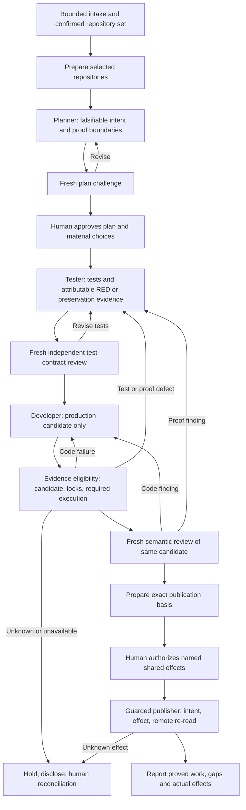

# 1. Executive assessment

**Verdict: Partially over-engineered. Status: proposed architecture; no implementation authorized.**

Reviewed checkout: `main`, `3e9345166cb387824e3cda36fb46ed940dfeea6d`. This is a static source review. No build, test, runner, browser, connector, installer, generator, or pipeline was executed.

**The most important finding is a source mismatch.** This repository is the Copilot-native reference implementation described in `README.md`, opening paragraph. It explicitly excludes the organization's runtime machinery. Its actual operational sources are nine agents, seven skills, five pipeline documents, global instructions, and VS Code settings. The seven `rstack-*` agents and nineteen referenced script filenames occur in the imported comparison material, not in an installed rstack implementation here. There is no executable invariant suite, generator, installer, `HARNESS-LIMITS.md`, or rstack gate source available to inspect.

Therefore:

- **FACT FROM REPOSITORY:** the reference has substantial duplicated normative procedure, multiple simultaneously authoritative documents, and genuine inconsistencies (§3).
- **INFERENCE:** this creates avoidable reading, reconciliation, and maintenance cost. It does not prove that nine roles or independent review are excessive.
- **RECOMMENDATION:** simplify ownership and operational context first. Preserve independent test construction, test-quality review, implementation verification, honest uncertainty, and publication identity.
- **NOT ESTABLISHED:** whether the missing production rstack scripts are redundant, effective, safe to delete, or expensive in operation. The imported descriptions are claims, not executable evidence.

The strongest five changes are: one canonical home for each rule; one transition/recovery specification; one candidate identity shared by verification, review and publication; compact role/mode contracts with shared artifact definitions; and optional, off-path history, metrics and memory. Do not install the proposed comparison files wholesale.

**Evidence notation:** FACT means inspected source/configuration or inventory, not observed host behavior. INFERENCE means analysis from those facts. RECOMMENDATION means a proposed change. “Script-checked” requires inspected executable code; a Markdown command example does not qualify. Repository-relative paths below are exact. Reconstructed files retain their suffixes and are never treated as installed sources.

# 2. Actual current architecture

## Source and scope

The authoritative starting points are [README](../README.md), [FLOW](../.github/pipeline/FLOW.md), [AGENT-CONTRACTS](../.github/pipeline/AGENT-CONTRACTS.md), [GUARDRAILS](../.github/pipeline/GUARDRAILS.md), the [pipeline agent](../.github/agents/pipeline.agent.md), and the [entry skill](../.github/skills/pipeline/SKILL.md). `FLOW.md:3` expressly says there is no state machine, scheduler or code.

An inventory of tracked files and a hidden/ignored-file-inclusive inventory outside `rstack-pipeline/` found no executable implementation of the named rstack mechanisms. The current working tree was clean in Git at review start. The comparison directory is ignored by `.gitignore:43`; Git status alone cannot verify this review's write boundary.

## Execution order and ownership

| Stage | Owner | Essential inputs | Outputs and permitted writes | Gate / loop / external effect |
|---|---|---|---|---|
| 0 Entry | pipeline + entry skill | Developer's ordered Jira keys; existing run | RUN.md only | Validate keys; confirm artifact-based resume; no external effect |
| 1 Intake | intake | Bounded Jira reads, directory listing, README/build-file evidence | INTAKE.md only | Pipeline asks G1 repositories and G2 branch/context; retrieved issues never expand scope |
| 2 Prepare | workspace | Confirmed RUN.md repositories and branch | WORKSPACE.md; prescribed Git preparation in selected repositories | Clean-tree/default/branch checks, fetch, fast-forward default, feature branch creation |
| 3 Plan | planner | plan-grounding; INTAKE.md; RUN.md; code; prior plan/review only on revision | PLAN.md only | Explicit requirement disposition, falsifiable criteria, interfaces, decisions |
| 4 Plan challenge | adversary, plan mode | plan-grounding + challenge-plan; requirements/context before plan; code | ADVERSARY-REVIEW.md only | APPROVE/REVISE/BLOCK; at most two rounds per cycle; G3 human plan approval |
| 5 RED | tester | test-contract skill; PLAN.md; code | Tests/support it owns; approved controlled-path amendment; test commit; TEST-CONTRACT.md and RED-REPORT.md | WITNESS/PRESERVATION classification; two attributable consecutive observations; gaps and amendment decisions |
| 5b Test challenge | adversary, test mode | test-contract; PLAN.md; test contract, RED evidence and controlled source | TEST-REVIEW.md only | ACCEPT/REVISE; one automatic correction round; accepted candidate amendments require Tester activation |
| 6 GREEN | developer | implementation-quality; plan, contract, RED; baseline; findings on fix rounds | Production and eligible ordinary envelope changes; local commits; IMPLEMENTATION.md | Controlled-path checks; bounded execution budget; human decisions for material deviation/test change |
| 7 Verify | verifier | implementation-quality; requirements/decisions first, then code and evidence; implementation claims last | VERIFICATION.md only; read/test execution in selected repositories | Preflight, contract/full-suite/relied-on execution, patch/obligation review; PASS/INCOMPLETE/FAIL |
| 8 Draft | pr | Plan, verification, intake and current run basis | PR-DESCRIPTION.md only | G4 approves concrete repository/ref/SHA/destination/content/publish-mode basis |
| 9 Publish | workspace | Current G4, verification and prior publication state | WORKSPACE.md publication intent/results; approved pushes | All-repository preflight; explicit verified object pushed; remote re-read; partial effects retained |
| 10 PR | pr | Approved draft, verification, run, publication and authoritative remote reads | PR.md intent/results; approved create-PR | Reuse exact current matches; no blind retry; creation requires post-create re-read |

Source: `.github/pipeline/FLOW.md:49-62`; the named agents' Inputs, Procedure and Forbidden actions; `.github/pipeline/AGENT-CONTRACTS.md`, Artifact ownership matrix.

No role may edit another role's artifacts. Developer may not edit tests or proof-relevant execution configuration. Tester cannot implement production behavior or add a required dependency as scaffolding. Adversary cannot edit the subject of either review. Verifier cannot repair code. These are **procedural path restrictions**: these roles hold general edit tools and/or a terminal. They are not filesystem sandboxes.

## Context, state and recovery

- **Freshness:** stage agents are described as stateless and receive role/mode-scoped invocation headers (`pipeline.agent.md:64`). Plan challenge derives requirements first; test challenge excludes its earlier plan-review inputs. Verifier derives obligations before reading implementation claims. Host prompt isolation has not been demonstrated (`docs/CORPORATE-ADOPTION.md`, CA-02).
- **Not the imported architecture:** actual Verifier both runs checks and reviews the patch. There is no separate post-gate `rstack-reviewer-architect`, and Verifier eventually reads IMPLEMENTATION.md. Its contract forbids re-reviewing plan quality and semantic test adequacy; stage 4 and 5b own those.
- **Per-run state:** twelve Markdown artifact types under `.pipeline/runs/<PRIMARY>/`; RUN.md stores selected repositories, decisions, gate bases, revisions, supersession and resume notes. TEST-CONTRACT.md stores anchors and controlled paths. Implementation and delivery artifacts retain reservations and effect state.
- **Persistent state:** feature-branch Git commits; private retained run evidence when the host/team provides it; owner-maintained `docs/HARNESS-LEDGER.md`. No operative `.rstack/learnings.md` consumer exists here.
- **Planning loop:** one initial challenge and one revision within a cycle; another cycle needs a human decision. New repositories return through G1 and preparation.
- **Test loop:** initial review plus one automatic correction. Amendments require the approved delta, full controlled-path transition patch, independent re-review, and explicit activation.
- **Implementation loop:** initial verification plus at most two fix rounds; implementation also has separate per-round 6 contract / 6 diagnostic / 2 handoff allowances. Reservations survive interruption.
- **Unobserved execution:** OBSERVATION_LOST / ENDED_INCOMPLETE produces HELD and reconciliation, not success, a synthetic failure, a fresh allowance, or automatic retry. Verification re-entry repeats preflight and completes pending obligations.
- **Delivery:** selected repositories are processed sequentially, not transactionally. Intent precedes effects. Unknown push/create outcomes require reconciliation and developer-confirmed continuation.
- **Scope:** one workspace root with multiple selected writable child repositories, not rstack's one writable active repository plus read-only siblings. Multiple ordered requested tickets may share a run; first key remains primary. Discovered tickets remain context.
- **External effects:** fetch, approved push and PR creation are present in the design. Jira writes, PR merge and deployment are outside its grants. Actual Jira/Bitbucket tool entries remain commented placeholders.

Sources: `FLOW.md`, Bounded loops / Resume by artifact; `implementation-quality/SKILL.md`, IQ3/IQ13; `test-contract/SKILL.md`, T6/T11/T12; `workspace.agent.md`, `pr.agent.md`; `docs/HARNESS-LEDGER.md:3`.

# 3. Contradictions found

Separate internal contradictions from differences between two architectures and from unverified behavior.

| ID / kind | Exact sources and disagreement | Consequence and disposition |
|---|---|---|
| C1 — Architecture mismatch, high adoption risk | `README.md:3` and `FLOW.md:3` describe a procedural nine-agent reference. `rstack-pipeline/references/harness-map.proposed-simplified.md`, Authority map / Gate check index, attributes enforcement to absent scripts. | Do not claim those scripts protect this checkout. Obtain live rstack source before its implementation review or deletion plan. |
| C2 — Actual contract contradiction | `AGENT-CONTRACTS.md:148` defines “—” as no interaction; rows 157–158 mark adversary “—” for TEST-CONTRACT.md and RED-REPORT.md. `adversary.agent.md:35-40` requires both in test-review mode. | The ownership table loses mode-specific reads. Make role+mode the unit of the canonical contract. Tester assessment's narrow IMPLEMENTATION.md input is likewise absent from the coarse matrix. |
| C3 — Actual bound ambiguity | `GUARDRAILS.md:109`: “Verifier/developer: at most two rounds.” `FLOW.md:59` and `AGENT-CONTRACTS.md:129`: one initial verification plus two fix rounds, third FAIL stops. | An abbreviated normative copy can stop too early. Preserve the explicit initial-plus-two policy in one owner; replace the other sentence with a pointer. No runtime divergence was observed. |
| C4 — Actual guarantee overstatement | `GUARDRAILS.md:113`: “Any edit” under governance always prompts. Lines 61–66 acknowledge unsandboxed build code; `.vscode/settings.json` provides edit-tool patterns, not a filesystem policy over runner subprocesses. | Limit the claim to the relevant edit-tool path and tested host. This is a static guarantee gap, not a reproduced bypass. |
| C5 — Capability specification versus shipped configuration | GUARDRAILS' capability table and `AGENT-CONTRACTS.md` describe Jira/Bitbucket capabilities, but `intake.agent.md:11-14` and `pr.agent.md:8-10` comment them out. | These are deliberate unresolved prerequisites, not enabled tools. The full workflow is not ready to run as configured. |
| C6 — Proposed review routing gap | Proposed orchestrator lines 122–128 route PASS to review but BLOCKED/proceedable directly to approval. Proposed tester lines 270–277 expects BLOCKED for scoped runs; proposed skill lines 399–408 requires scoped eligibility before review. | No complete, unambiguous scoped-to-review transition is specified; waiver routing can bypass review and then collide with approval's required CLEAN review. Define review eligibility separately from release eligibility. Missing gate code prevents confirming its current behavior. |
| C7 — Proposed stale-review gap | Proposed approval lines 118–170 and proposed orchestrator line 152: review → integration → full test re-gate → approval. Proposed approval lines 83–91 checks review CLEAN but pins only ACs to current HEAD. | A changed integrated tree can inherit a prior semantic review. Bind both verification and review to the final candidate; changed content requires renewed review. A merge may be a no-op, so inspect identity rather than assume it changed. |
| C8 — Proposed audit ownership conflict | Proposed planner Step 9 performs the audit before reporting and declares the auditor in frontmatter. Proposed orchestrator Phase 1b separately dispatches the audit after planner returns. | Double dispatch or waiting deadlock is possible unless one driver owns the handoff. Planner should return a plan; driver alone dispatches the auditor. This overlap also appears in the reconstruction. |
| C9 — Proposed metrics provenance conflict | Proposed discovery-cost lines 17–19 distinguish tool-observed from agent-reported, but lines 31–37 label run-log-derived spawns/verdicts/timestamps OBSERVED. Proposed orchestrator Run log makes the model the writer. Discovery-cost line 58 also treats a citation as proof of a read. | Parsing a self-report does not independently observe execution or reading. Preserve provenance through derivation; verify with host traces or label AGENT_REPORTED. |
| C10 — Different multi-repository contracts | Actual FLOW stages 2/6/9 operate in every G1-selected repository. Proposed estate-layout “One writable repository per run” and estate template lines 13–21 assume a non-Git estate root and one writable child. | Substitution would remove an existing enterprise behavior; this workspace root is itself a Git repository. Do not silently adopt that template. |
| C11 — Different commit/failure policies | Actual developer/tester create local commits and Verifier blocks every full-suite failure (IQ11). Proposed dev forbids commits; proposed pipeline permits a human-approved BLOCKED/proceedable suite-waiver path and requires separate final-commit approval. | These are product-policy changes, not deduplication. Preserve actual behavior unless explicitly changed. |
| C12 — Proposed authority inconsistency | Proposed instruction-precedence separates subject ownership from host loading; proposed process instructions lines 13–14 says process rules simply win a conflict. | Qualify subject ownership and host limits consistently. A local document cannot guarantee its own precedence. |

“Read-only” Adversary/Verifier means no edits to reviewed subjects, not absence of all edit capability. Global developer-approved Git exceptions versus stricter structured-pipeline prohibitions are different scopes, not automatically contradictory. Historical “pending review” statements remain dated records; do not rewrite them as current status.

# 4. What is genuinely strong

**FACT:** the following controls are present as operative procedure and solve identifiable failure mechanisms:

1. Requirement disposition and provenance prevent dropped or invented scope (`plan-grounding/SKILL.md`, R1/R5/R6).
2. Independent outcome-first test review catches tests that assert proxies or double the responsible component (`test-contract/SKILL.md`, T3/T4/Challenge).
3. Test integrity covers support files, proof-relevant configuration, relied-on tests, committed content and working-tree changes; a file hash alone would miss excluded tests (`GUARDRAILS.md`, Test immutability mechanism).
4. Amendment lineage distinguishes fixing how a test observes from changing what the requirement means. Candidate anchors do not become active merely because Tester created them (T12; `tester.agent.md`, activation mode).
5. Verification checks obligations and the full patch beyond green tests; introduced defects can block through a concrete mechanism and established invariant (IQ11/IQ12).
6. Missing proof stays INCOMPLETE; pre-existing suite failures stay failures. A human decision cannot manufacture evidence (T10; IQ11).
7. Verified SHA, approved destination/ref/content, durable external intent and remote re-reads address stale publication and duplicate PR creation (`workspace.agent.md`, `pr.agent.md`).
8. Unknown execution/effect outcomes survive resume rather than becoming new clean attempts (`docs/specs/2026-09-14-harness-execution-observation-amendment.md`, §2/§6).

The ledger documents earlier **document-scenario findings**, not measured production incidents. Imported originals describe real-run incidents, but this checkout contains no independent records establishing those claims. Preserve the failure mechanisms without inflating their evidence level.

# 5. Accidental complexity

| Mechanism | Classification | Smallest sufficient change |
|---|---|---|
| Same resume/STOP/activation procedure in entry skill, pipeline agent, FLOW, contracts and historical clauses | Duplicated policy; high maintenance cost | FLOW owns transitions and recovery; entry parses; agent dispatches |
| Agent templates repeated in AGENT-CONTRACTS and each agent body | Duplicated schemas | Central contracts own shape and mode inputs; agents retain purpose/method/local prohibition |
| Current skill yields to historical contract plus later amendment | Distributed authority | Explicitly supersede mapped clauses into current canonical owners; retain old files unchanged as history |
| Developer and Verifier both required to read the entire implementation-quality skill | Irrelevant role context | Split reading by common invariant / construction / review sections before adding any new files |
| Long exception lists in orchestrator Forbidden actions | Implicit state machine encoded several times | One transition table with preconditions and next owner; no engineering judgment in routing |
| Full suite at Developer handoff and again at independent verification | Potential duplicated execution, not redundant trust | Measure reuse of trusted immutable evidence first; keep independent verification until equivalence is demonstrated |
| Numerous independent counters and repeated mode state | Potentially excessive, not proven waste | Centralize existing accounting; measure before changing numeric budgets |
| OCR appendix counted as agent instructions | Comparison-data distortion | Exclude archival OCR from prompt estimates; preserve attachment as supplied |
| Proposed memory, metrics, estate pinning and waiver machinery imported by default | Unproven additions to this checkout | Do not add them; qualify needs before selecting mechanisms |

## Content classification

| Current location/block | Class | Recommended home |
|---|---|---|
| FLOW Stages, Gates, STOPs, Bounded loops, Resume | CONTRACT | FLOW alone |
| Agent permitted inputs, outputs, tools and fixed artifact sections | CONTRACT | Mode contracts + frontmatter for actual tool grants |
| T3/T4/T9/T10/T12 and IQ2/IQ11/IQ12 | CONTRACT | Existing policy skills, with narrow section reads |
| GUARDRAILS regex explanation and actual limits | ENFORCEMENT DOCUMENTATION | GUARDRAILS with a pointer to actual settings; no duplicate editable JSON |
| README prerequisites; CORPORATE-ADOPTION | OPERATOR GUIDANCE | Human entry/adoption docs, on demand |
| GUARDRAILS “R2 extended…” chronology; skills' historical authority chains | HISTORICAL NARRATIVE plus retained authority | Extract authority explicitly, then retain rationale in existing specs/ledger |
| Imported original tester's measured log anecdote and old-rule stories | HISTORICAL NARRATIVE | Maintainer evidence, after obtaining original records; retain short invariant locally |
| Model benchmark candidates; RUN-AUDIT measurement guidance | OPERATOR GUIDANCE | Off the stage hot path |
| docs/examples and contract challenge tables | DOCUMENT SCENARIOS | Keep as examples; never call them executed invariant tests |

# 6. Canonical responsibility map

These are **recommended owners**, not a claim that ownership is already centralized. Actual paths are retained unless marked NEW in the source-tree document.

| Concern | Current owners | Recommended canonical owner | Enforcement | Duplicates to remove |
|---|---|---|---|---|
| Orchestration | FLOW, pipeline agent, entry skill | FLOW transitions; pipeline dispatch only | Procedural now | Full stage descriptions in entry/agent |
| Phase routing/recovery | FLOW, pipeline, contracts, IQ/T skills | FLOW | Optional deterministic evaluator after approval | Repeated resume and STOP essays |
| Acceptance criteria | Planner, plan-grounding, contracts | plan-grounding R1/R5/R6 | Semantic audit + human | Agent/template policy copies |
| Plan interview | plan-grounding R6, pipeline G3 | plan-grounding decision rules | Human; completeness checks may be mechanical | Imported separate interview lifecycle |
| Evidence meaning/levels | test-contract, IQ, agents, contracts | test-contract proof boundary; IQ verdict interpretation by reference | Semantic review + attributable execution | Numeric ladder imported without prove-it |
| Artifact schemas | Contracts and every agent | AGENT-CONTRACTS artifact schemas | Procedural now; optional validator | Full per-agent templates |
| Artifact/read/write ownership | Contracts, GUARDRAILS, agents | AGENT-CONTRACTS role+mode matrix | Host tools coarse; paths procedural | Independent lane matrices |
| Tool grants | Agent frontmatter, contracts, settings | Agent frontmatter; settings owns approval patterns | Host-dependent; unverified | Invented mirrored tool names |
| Active repository resolution | intake/discovery, G1, workspace | discover-affected-projects; RUN confirmed set | Human G1 + preparation | Imported competing estate resolver |
| Sibling behavior | GUARDRAILS, agents, FLOW | GUARDRAILS selected-vs-context scope | No filesystem sandbox | One-active-repo rule imposed globally |
| Test ownership | tester, contracts, T9, GUARDRAILS | T9 semantics; mode matrix capability | Procedural + independent comparison | Long local copies |
| Production ownership | developer, contracts, IQ | IQ2 and mode matrix | Procedural | Repeated production/test tables |
| Test immutability | T9/T12, IQ2, verifier, GUARDRAILS | T9/T12; consumers reference it | Git/content and execution checks when run | Repeated anchor/amendment algorithms |
| Gate semantics | FLOW, pipeline, verifier, IQ | IQ defines result; FLOW consumes it | No gate script here | Narrative gate reinterpretation |
| Review semantics | challenge-plan, T Challenge, IQ Verification | Each distinct review method in its existing skill | Independent role; semantic | Reviewer method in author prompts |
| External actions | GUARDRAILS, workspace/pr, G4 | GUARDRAILS action policy; FLOW G4 binding | Human + host; no authenticated gate service | Imported per-action reapproval everywhere |
| Local commits | tester/developer/workspace, settings | GUARDRAILS policy; role mode procedure | Git command approval + scope check | “Nothing leaves” conflating local commit and push |
| Push | workspace, GUARDRAILS A3, contracts | workspace publisher procedure; G4 policy link | Exact object + re-read, procedural | Full A3 quotation in multiple files |
| PR | pr, contracts, FLOW | pr procedure | Connector + human; missing tools here | Duplicated candidate/retry procedure |
| Merge | GUARDRAILS, workspace; imported approval | GUARDRAILS | Actual preparation ff-only; no PR merge | Ambiguous “never merge” shorthand |
| Risk/depth | plan-grounding, T14, IQ10, model notes | plan-grounding R2 with explicit required surfaces | Judgment, no phase elision | Parallel LOW/MEDIUM/HIGH taxonomy |
| Impact analysis | plan evidence, verifier inventory/I checks | Verification method in IQ11 | Source inspection | Mandatory new impact artifact without a consumer need |
| Learnings/memory | Ledger, run audit, knowledge draft; imported learnings | Owner-reviewed ledger; knowledge experiment remains deferred | Human curation | Runtime auto-append memory |
| Run metrics | RUN notes, RUN-AUDIT; imported metrics | RUN-AUDIT guidance | Host evidence if available | Second metrics state store |
| Instruction precedence | global rules, HARNESS, historical clauses | HARNESS authority index + explicit supersession | Host loading must be tested | Claimed universal host precedence |
| Prompt injection / MCP trust | Global, GUARDRAILS, each agent | Global trust rule; one local reminder at each intake/action boundary | Capability separation, not text guarantee | Full repeated trust essays |
| Audit provenance | Headers, RUN history, RUN-AUDIT | RUN-AUDIT provenance definitions | Independent host receipts where available | Treating self-labelled TOOL/OBSERVED as attestation |
| Human escalation | FLOW, pipeline, skills, contracts | FLOW | Human decisions recorded against exact basis | Duplicate freeform escalation contracts |

# 7. Enforcement map

| Major invariant | What exists here | Classification / limit | Minimum sufficient V2 control |
|---|---|---|---|
| Falsifiable intent; no invented completeness | plan-grounding + adversary + G3 | Prose/human; no schema proves semantics | Keep independent requirement derivation and human unresolved-choice decisions |
| Separate test and production authors | Role bodies and tool lists | Path lanes are prose; general edit/terminal capability remains | Distinct roles; host-scoped write grants for a guaranteed profile |
| Tests not silently weakened | T9/T12 anchors, transition patch, review, execution identities | Commands specified, not executed by repository code | Compare complete controlled content and discovery/execution identities; reviewed amendments |
| Production tested before review | Actual Verifier checks and reviews in one invocation | Ordering procedural; no separate post-gate reviewer | Complete evidence eligibility before fresh semantic review mode |
| Fresh context | Mode input lists and invocation header | Prose; CA-02 unverified | Host-created isolated invocation with allowed inputs; audit actual assembly |
| Evidence not silently upgraded | T10/IQ verdict rules; TOOL tags | No trusted capture service; tags can be model-written | Retain raw host receipts, exact candidate identity; absent receipts remain unproven |
| Required artifacts/current revisions | RUN history and role procedures | Prose; no schema validator | One consumer-side checker if executable profile approved |
| Wrong repository prevented | G1 selection and Git -C forms | Detect/check procedure; no filesystem containment | Canonical roots plus host filesystem/credential restrictions; symlinks and subprocesses included |
| Gate/approval bound to reviewed object | G4 and explicit-SHA push | Prose+human; regex checks command shape, not approval | Trusted dispatch verifies exact approved tuple and current evidence |
| Human controls external effects | G4; omitted Jira-write/merge tools | Tool grants host-dependent; terminal can have indirect effects | Separate authorized publisher capabilities; no new actor self-signs approval |
| Unknown external effect not repeated | WORKSPACE/PR intent and recovery | Procedural, non-atomic | Preserve intent/result/reconciliation; remote identity checks |
| No agent-declared completion | Aggregate current verification/PR rules | Pipeline judgment; no deterministic gate | Completion predicate from required evidence and effects, not narrative |
| Governance protected | edit autoApprove false globs | Prompt, not hard block; runner writes not covered | Host-owned immutable governance for enforced profile |
| No silent skip | INCOMPLETE, HELD, NOT_RUN, exceptions | Prose | Explicit non-success states; fail closed on missing required proof |
| Metrics independent of agents | No collector; optional host export | Human/host; not present as verified capability | Derive once with inherited provenance; keep off release gate |

**No major invariant is verified here as script-enforced by rstack.** Host tool omission is a meaningful capability restriction when honored; neither that nor a diff check contains arbitrary repository-controlled code. A checker detects a violation after the fact; it cannot undo an escaped write. A schema can validate a human-name field, not authenticate the human.

# 8. Duplicate-rule map

| Rule | KEEP IN | REMOVE FROM | OPTIONAL REMINDER | ENFORCED BY today |
|---|---|---|---|---|
| Developer never edits controlled tests | test-contract T9/T12 | Full copies in GUARDRAILS/agent/contracts | One sentence in developer and verifier | Procedural diff + review |
| Tester cannot implement production | Mode ownership contract | Repeated lane tables | Tester boundary | Prose/tool scope |
| Auditor/reviewer cannot fix subjects | Mode contract | Repeated full prohibitions | Review-role body | No terminal for adversary; edit path scope prose |
| Test amendment cannot change requirements | T12 | Developer and orchestration essays | “Route amendment, do not self-edit” | Independent review + human |
| No silent skip / INCOMPLETE is not PASS | T10 + IQ verdict | Every transition restating proof semantics | Final report lists gaps first | Procedural gate |
| No fabricated/upgraded evidence | Evidence semantics + RUN-AUDIT provenance | Metrics and agent restatements | Tester/verifier capture reminder | Independent execution, if actually observed |
| Human external authorization | GUARDRAILS + FLOW G4 | Repeated multi-page approval summaries | Workspace/pr action precondition | Human; host-specific |
| No PR merge / no history rewriting | GUARDRAILS | Role-specific explanations of all dangerous commands | One role prohibition | Tool omission for PR merge; terminal limitations |
| Approved repo set only | GUARDRAILS + G1 | Estate-like repeats across skills | Writer checks scope | Procedure; no sandbox |
| Fresh context | Mode input contract | Repeated “fresh means fresh” prose | Reviewer excludes implementation persuasion | Host dispatch unverified |
| Falsifiable AC / green tests prove assertions only | plan-grounding / test-contract Challenge | Planner/tester/reviewer full essays | One proof-boundary reminder | Semantic independent challenge |
| Artifact references instead of narrative handoff | Pipeline invocation contract | Repeated payload guidance in every role | Local output path | Pipeline procedure |
| Unresolved execution remains unresolved | One execution/recovery rule in FLOW + IQ/T semantics | Repeated recovery paragraph in entry/agents/contracts | “Return HELD; do not relaunch” | Procedure only |
| Per-artifact schema and headings | AGENT-CONTRACTS | Full header/template copies in agents | Output name + schema pointer | No validator |
| Evidence stales when basis changes | FLOW freshness rule | Duplicated resume paragraphs | Publisher exact identity check | Procedure + Git reads |

Local reminders are intentionally retained where losing them would make an isolated role unsafe. Repeating a two-line boundary is different from maintaining five independent algorithms. The controlled-path concept appears in eleven operational Markdown files; not every occurrence is redundant, but several contain the full procedure.

# 9. Artifact inventory

## Actual .pipeline artifacts

All twelve types have decision consumers. Their records may be revised under explicit ownership; historical observations cannot be regenerated truthfully after loss.

| Artifact | Writer → readers | Decision supported | Regenerable / durable | Action |
|---|---|---|---|---|
| RUN.md | pipeline → permitted stage modes | Scope, approvals, revisions, resume | Derived status can regenerate; human decisions/history cannot; retain privately | KEEP; derive summaries from owned facts |
| INTAKE.md | intake → planner/adversary/pr/pipeline | Requirement provenance and scope | Fresh retrieval differs from original snapshot; retain | KEEP |
| WORKSPACE.md | workspace → developer baseline/verifier/pr/pipeline | Prepared repositories and external effects | Current refs re-readable; historical intent/results not regenerable | KEEP; separate sections, not a second state file |
| PLAN.md | planner → engineering/review roles | Approved intended behavior | New plan is a new revision; retain | KEEP |
| ADVERSARY-REVIEW.md | adversary → planner/verifier/pipeline | Plan eligibility and residual findings | Re-review is new evidence; retain | KEEP |
| TEST-CONTRACT.md | tester → test reviewer/developer/verifier/pipeline | Proof routes, identities, lock/anchor/amendments | Cannot reconstruct approved lineage from current tests alone | KEEP |
| RED-REPORT.md | tester → test reviewer/developer/verifier/pipeline | Discrimination before implementation | New replay is new evidence; retain receipt | KEEP; do not merge away independent execution identity |
| TEST-REVIEW.md | adversary → tester/verifier/pipeline | Test adequacy and amendment activation | Re-review generates new decision | KEEP |
| IMPLEMENTATION.md | developer → verifier/pipeline; bounded tester request | Attempts, gaps, deviation claims, fix request | Some inventory derivable, attempt history not | KEEP; reduce to claims requiring later decisions |
| VERIFICATION.md | verifier → pipeline/developer/workspace/pr | Candidate eligibility, findings, verified SHA | New verification required for changed basis | KEEP |
| PR-DESCRIPTION.md | pr → pipeline/pr/human | Exact content approved for publication | Draft regenerable; approved version immutable basis | KEEP |
| PR.md | pr → pipeline/human | PR identity, intent, completion/recovery | Remote can be re-read; original uncertainty/history cannot | KEEP |

Source: `AGENT-CONTRACTS.md`, Artifact ownership matrix/templates, and `FLOW.md`, Resume by artifact. Durability is a private-host/team responsibility; local ignored files alone do not establish restorable history.

## Imported .rstack model — documented, not present run state

Paths here are the comparison contract's paths, not discovered runtime artifacts. “Unknown path” means the script-owned filename was not available; inventing one would conceal the gap.

| Artifact/state | Claimed writer → reader / decision | Regenerable / durable | Recommendation and rationale |
|---|---|---|---|
| runs/<KEY>/ac.tsv | Planner seeds, Tester proves → gate/reviewer/approval | Criteria durable; evidence revision-bound | MERGE conceptually into requirements/proof map; do not commit a self-referential current-HEAD proof file |
| meta/ticket.md | Planner → auditor / original intent | Retrieval not original snapshot; run retention | KEEP equivalent intake provenance; redact secrets rather than blindly persist all tracker text |
| plan/plan.md | Planner → test/dev/review | Versioned judgment | KEEP |
| plan/plan-audit.md | Auditor reply via driver → planner/gate | Re-audit is new; retain rounds | KEEP decision; prefer direct host receipt over model transcription |
| plan/plan-audit-response.md | Planner → checker/tester | Disposition history | MERGE into revised plan's finding-response section; retain audit revision link |
| evidence/red.txt | Tester → gate / discrimination | Cannot reconstruct old observation | KEEP attributable raw receipt |
| evidence/suite.txt + raw capture | Capture/Tester → gate | New run is different; retain required evidence | KEEP raw identity; DERIVE concise view without erasing failures |
| evidence/test-report.md | Tester → dev/review | Summary derivable from results | DERIVE; retain handoff only when a decision needs it |
| evidence/impact.md | Tester → reviewer | Search inventory regenerable at pinned ref | MERGE into evidence/review input; keep search scope and blind spots |
| review/review.md | Reviewer via driver → approval | New review is new evidence | KEEP, bound to candidate + test-contract revision |
| approval/approval.md | Approval → human | Preparation derivable; actual authorization not | MERGE preparation into delivery record; human receipt remains distinct |
| logs/run-log.tsv | Orchestrator → metrics/human | Events not reconstructable independently from prose | DERIVE from host dispatch if available; otherwise AGENT_REPORTED |
| .rstack/learnings.md | Orchestrator → later phases except fresh reviewers | Mutable hints; optional persistence | DELETE from default V2 runtime proposal; retain only a separately justified experiment |
| evidence/suite-waivers.tsv | Base replay + named human → gate/approval | Replay repeatable, authorization not | Do not import default release waiver; requires owner policy decision |
| evidence/observation-accept.tsv | Human → gate/approval | Authorization not proof | Do not use to raise evidence level or permit verified completion |
| shared/boundary-waivers.tsv | Guard/authorization path → guard/human | Authorization must retain scope | MERGE into authenticated action decision if an exception feature is justified |
| shared/estate-repins.tsv | Repin path → estate guard/human | Past baseline change not regenerable | Not needed for current reference; preserve rationale if live estate support proves necessary |
| Estate pin and dirty baseline (script-owned filename unknown) | Pin operation → estate guard | Re-pin is new basis, not reconstruction | Conditional KEEP for detected drift; prefer isolated clean selected workspace over subtractive dirty-file exemptions |
| Test-lock data (script-owned filename unknown) | Tester/capture → lock/gate | Original lock not reconstructable from edited tests | KEEP integrity concept; require content, configuration and execution identity, not assertion counts alone |
| .rstack/boundaries.json | Maintainer → classifier/guards | Durable policy | Conditional KEEP as protected host policy; ordinary agent must not edit/reclassify it |
| Host OTel/session store | Host → otel/chat reader | Retention-dependent | KEEP as optional provenance source; do not invent telemetry state or treat absence as observed |
| Metrics summary / post-run docs | Derived metrics → maintainers | Regenerable while receipts retained | DERIVE on demand; no additional release gate |

Sources: imported `handoff-contracts.*`, Artifact registry and individual schemas; original `estate-layout`, Why a script; original `write-boundaries`, Commands/Baseline; original pipeline Layout/stop flag. Full pin/lock inventory remains unverified without scripts.

# 10. Agent-by-agent redesign

Preserve distinct judgment responsibilities; reduce prompt responsibilities before reducing agent count.

| Actual role / imported counterpart | Current unique purpose | Recommended responsibility and essential input/output | Required / forbidden capabilities | Remove / keep / add; separation |
|---|---|---|---|---|
| pipeline / rstack-orchestrator | Dispatch, gates, recovery, RUN state | Dispatch from canonical transition result; input references + trusted human answer; output RUN decision/history | Ask, read exact artifacts, write own state, dispatch; no engineering edits or publisher capability | Remove copied algorithms and semantic verdict interpretation; keep scoped mode headers; add explicit eligibility predicate. Keep separate |
| intake / part of rstack-planner | Isolate untrusted tracker retrieval | Bounded facts and repository recommendation → INTAKE | Tracker reads and own artifact; no terminal or external writes | Keep capability isolation; remove delivered-R3 fallback chronology. Do not merge into terminal-enabled Planner just to match rstack |
| workspace / parts of planner+approval | Repository preparation and publish effects | Exact confirmed roots/basis → WORKSPACE intent/results | Git through allowed action adapter; no semantic review, code repair or raw tracker | Keep separate capability boundary; centralize command mechanics. Could become a trusted deterministic adapter only after host evidence |
| planner / rstack-planner | Requirements, evidence, plan | Intent + permitted code/context → PLAN with decisions | Read/search + own plan; no tests, production, approvals, self-audit | Remove audit dispatch/branch mechanics from imported version; keep falsifiability and provenance. Separate from auditor |
| adversary plan mode / rstack-plan-auditor | Independent plan challenge | Requirements first, then plan/evidence → audit verdict | Read subjects + own result only; no terminal needed by actual contract | Keep independent derivation; remove duplicated policy; bind result to plan revision. Separate invocation from planner |
| tester / rstack-tester | Independent executable definition of done | Approved criteria → tests, proof map, RED receipt, amendments | Scoped test/support edit and approved execution; no production or publishing | Keep proof-boundary judgment, preservation and honest gaps; move capture mechanics out only when replacement exists. Separate from dev |
| adversary test mode / no separate imported equivalent | Challenge the tests before implementation | Criteria before test source → TEST-REVIEW | Read subjects and own result; no test editing | Keep; imported “Tester then Developer” must not silently remove this proven architectural separation. Reuse role definition, fresh invocation |
| developer / rstack-dev | Produce behavior under approved proof contract | Plan/tests → committed candidate and concise implementation claims | Scoped production edits, approved local runs/commits; no test/evidence rewriting | Remove verifier method from its required read set; keep budget and self-check. Its success never establishes completion |
| verifier / rstack-reviewer-architect + gate | Independent checks and obligation/patch review | Approved intent, candidate, current test review and receipts → VERIFICATION | Read/test execution today; own report; no fixes or publication | Use separate fresh semantic-review mode after evidence eligibility; postpone claims until after independent derivation. No new author/reviewer merge |
| pr / part of rstack-approval | Approved-content draft and guarded PR action | Current verification + approved publication tuple → draft/PR record | Exact connector reads/create capability; no terminal or source edits | Keep authority separation; deterministic identity checks belong in action adapter; keep unknown-result recovery |

The imported approval role combines integration, stash management, evidence judgment, final commits and connector writes. Do not import that concentration into this reference. “Approval” is a human decision plus a guarded action, not a substitute engineering reviewer.

**Models:** actual `MODEL-ROLES.md` specifies a picker-selected Sonnet-5 baseline and deferred benchmarks; frontmatter omits model pins. Imported roles request Sonnet/Opus allocations but no dispatch measurements are available. Neither vendor diversity nor better defect detection is established. Do not change models as part of simplification; measure independent outcomes, not model labels.

# 11. Pipeline skill redesign

For this checkout, retain `.github/skills/pipeline/SKILL.md` as a short entry point:

1. Required selected role and host prerequisites, explicitly not self-verifiable.
2. Parse ordered keys, preserve first primary, handle invalid/duplicate input.
3. Locate a run and hand its identity to the driver.
4. Link to FLOW for state, transitions, recovery and human decisions.
5. State that entry parsing grants no further tool or write permission.

Remove the duplicate artifact-order/resume algorithm only after FLOW is the single current owner. Do not move all agent operating manuals into this skill.

For a future rstack installation, the imported skill's orchestration table is a useful concept, but its 466 lines still repeat schemas, memory, write policy, evidence philosophy and release rules. A short map should link those owners. The proposed suite-capture wrapper is a **missing dependency**, not a shortening already achieved in code.

# 12. Reference redesign

## Actual files

| File | Action | Reason |
|---|---|---|
| .github/pipeline/FLOW.md | KEEP, consolidate | Sole transition/gate/recovery contract |
| .github/pipeline/AGENT-CONTRACTS.md | KEEP, simplify | Mode-specific IO/ownership + artifact schemas; stop duplicating methods |
| .github/pipeline/GUARDRAILS.md | KEEP, simplify | Trust, external-effect policy, actual enforcement limits |
| .github/pipeline/HARNESS.md | KEEP, shorten if needed | Optional index, never a second authority |
| .github/pipeline/MODEL-ROLES.md | KEEP off hot path | Human model selection/benchmark/change decisions |
| docs/CORPORATE-ADOPTION.md | KEEP | Actual compatibility record; no duplicate HARNESS-LIMITS file |
| docs/HARNESS-LEDGER.md | KEEP | Owner-reviewed generalized lessons, not runtime memory |
| docs/RUN-AUDIT-AND-IMPROVEMENT.md | KEEP optional | Provenance, retention and measurement without a new collector |
| docs/specs historical normative clauses | ARCHIVE authority only after extraction | Preserve the files and dated record; explicitly supersede exact clauses |
| docs/reviews and examples | KEEP historical/scenario status | Do not rewrite old verdicts into current evidence |

## All thirteen comparison reference pairs

Neither version is an authorized replacement. The suffix `proposed-improved` applies to team-adoption and write-boundaries; all other proposed suffixes are `proposed-simplified`.

| Comparison reference | Proposed change worth keeping | Lost/changed protection or unresolved dependency | V2 disposition |
|---|---|---|---|
| approvals-reference | Distinguishes friction from isolation; removes anecdotes | Broad tool approval/host parsing claims need actual version/config tests; differs from current narrow literal rules | MERGE policy into GUARDRAILS; configuration remains actual settings; reject blanket allow migration |
| discovery-cost | Explicit unavailable/provenance and memory value test | Incorrect OBSERVED labels for agent logs; citation does not prove reading | MERGE concepts into RUN-AUDIT; correct provenance |
| estate-instructions.template | Short bootstrap and local paths | Assumes non-Git root and one writable repo; installer absent | ARCHIVE as alternate-host example; do not install |
| estate-layout | Clarifies repin authorization and repository identity | Dirty baseline/pin implementation absent; incompatible writable-scope model | MERGE only selected/context-repo distinction; keep enterprise multi-repo contract |
| handoff-contracts | One artifact registry and malformed-handoff rule | Still repeats role templates; no validators; HEAD/committed AC cycle unresolved | MERGE concepts into AGENT-CONTRACTS; use stable candidate identity |
| harness-map | Optional owner/enforcement index | Describes missing scripts and capability inventory as runtime truth | KEEP actual HARNESS; do not add another map |
| instruction-precedence | Separates semantic ownership from host precedence | Still relies on absent guards; cannot declare host independence by prose | MERGE into actual authority map/GUARDRAILS |
| learnings | Optional, revalidated leads; no fixed age-only retention | Validator absent; value not demonstrated; current memory experiment is deferred | DELETE from default runtime proposal, preserve comparison |
| plan-interview | Ask consequential decisions, discover facts | Removal must not discard unknowns/provenance or require silence-as-consent | MERGE into plan-grounding R6 |
| risk-tiers | Rejects LOC alone as semantic risk | Orchestrator still suggests script-driven tier raises; existing reference has different class behavior | MERGE into one explicit depth/surface policy, no second tier taxonomy |
| rstack-process.instructions | Short trust/evidence reminders | Claims precedence; widens intended external actions; assumes scripts/agents exist | MERGE only supported global reminders; no new installation |
| team-adoption | Separate playbooks; adapt mechanics to evidence | Three pilot shapes are exploratory, not proof of effectiveness | MERGE concepts into CORPORATE-ADOPTION |
| write-boundaries | Explicit human exceptions; honest orchestrator gap | Hash/skip/assertion claims unverified; self-reported producer is not authentication; “read-only” auditor has a terminal | MERGE semantics into role/mode contract; host boundary required for guarantee |

# 13. Script redesign

**All nineteen filenames below are referenced in the comparison bundle and absent as source in the inspected checkout.** No deletion recommendation below is an executable deletion plan. Claimed plugin-relative locations cannot be verified as actual repository paths. `prove-it`, `ac-matrix`, `repo-locate`, `evidence-auditor`, `models.json`, invariant tests and host installation sources are additional unavailable dependencies.

| Referenced script | Claimed failure prevented / state introduced | Recommended disposition once real source is available |
|---|---|---|
| ac-check.mjs | Malformed/stale/under-proven AC rows | KEEP validation function; MERGE shared schema; it cannot judge assertion adequacy |
| audit-response-check.mjs | “Fixed” audit reply without cited plan change | SIMPLIFY into review-disposition validation; independent re-audit still judges substance |
| base-replay.mjs | False RED/pre-existing-failure claim; replay/waiver artifacts | KEEP discrimination where needed; quarantine fail-release waiver feature pending owner decision; inspect replay isolation and cleanup |
| boundaries.mjs | Inconsistent path classification | KEEP one classifier if guards exist; protect policy and reject ambiguous paths |
| role-guard.mjs | Out-of-lane changes; baseline/waiver state | MERGE common identity/classification; evaluate per-invocation attribution, not whole-tree author inference; check is not prevention |
| estate-guard.mjs | Wrong repo/sibling drift; pins/repins | Conditional KEEP for an actual estate use case; not a default new system in this reference |
| test-lock.mjs | Changed/deleted/skipped tests; lock/amendment state | KEEP content/membership checks; assertion counts only advisory, never semantic proof |
| gate.mjs | Missing/stale evidence and failed release prerequisites | KEEP one pure result aggregator; separate review eligibility from release success; validate same candidate |
| change-budget.mjs | Unplanned growth; estimates/overrun | SIMPLIFY to optional diff signal; no automatic risk from LOC ratio; delete if no decision consumer |
| learnings-check.mjs | Oversized/malformed/instruction-shaped memory | DELETE from default proposed runtime with memory; conditional shape check only for approved experiment |
| otel-trail.mjs | Claims disagree with independent host spans | KEEP optional provenance adapter if source supports independence; absence cannot establish execution |
| chat-trail.mjs | Missing model/dispatch provenance | MERGE shared host-session reading with OTel adapter where semantically equivalent; do not collapse distinct evidence sources |
| pipeline-metrics.mjs | Misleading run cost counts | DERIVE from retained events; preserve AGENT_REPORTED ancestry; optional, not a release gate |
| protect-artifacts.sh | Accidental evidence staging/exposure; ignore mutations | SIMPLIFY installed retention/staging policy; ignore rules are not access protection and do not untrack files |
| doc-check.mjs | Incomplete post-run documentation/unsafe pruning | Keep out of delivery; SIMPLIFY to retention completeness only if humans use the output; do not auto-delete evidence |
| gen-copilot.mjs | Generated agents drift from canonical source | KEEP only if generation is actually needed; require deterministic source/output comparison; absent here |
| install-estate.mjs | Misplaced instructions/install drift | Conditional KEEP for supported host; preserve local settings and report exact changes; absent here |
| setup.mjs | Approval configuration installation/migration | KEEP exact-rule ownership and reversible migration if real installed fleet exists; never broad overwrite |
| resolve.sh | Ambiguous repository aliases | SIMPLIFY canonical root resolution in one adapter; no resolver needed beyond confirmed paths without demonstrated ambiguity |

Actual enforcement-related files are `.vscode/settings.json` and agent frontmatter. Their settings are inspectable; host behavior is not proven. Existing challenge cases in Phase 3/4 contracts and examples are **document scenarios**, not scripts that passed.

**Prose worth making code, conditionally:** exact roots/paths, current artifact basis, complete controlled-path content, enum/required-field shape, ordered prerequisites, current approved publication tuple, consumed attempt reservations. **Prose that must remain judgment:** criterion adequacy, equivalent observable proof, whether a defect mechanism is real, scope consequences, semantic redaction.

Avoid artifact → validator-report → report-validator chains. One check returns a typed result citing raw receipts; later decisions consume that result directly. A gate cannot attest its own trusted execution just by writing another signed-looking Markdown section.

# 14. Context budget

**Measured source size, not runtime token usage:** the 22 operational Markdown files under `.github/` total 489,540 characters and approximately 69,289 whitespace-delimited words. Settings, historical docs, task artifacts and source code are excluded. Only `.github/copilot-instructions.md` explicitly says it applies globally (1,511 characters). Do not claim all 489,540 characters load in every invocation.

Minimum role-package sizes below add the role body, explicitly required skill(s), and global instructions. They exclude artifacts, code, other referenced contracts and host injection; they are comparison baselines, not observed host context.

| Role/mode | Current package characters | MUST KNOW | MAY LOOK UP | MUST NOT RECEIVE by default |
|---|---:|---|---|---|
| pipeline + entry | 56,437 | Next transition, basis, owner, human stops | Exceptional recovery details | Implementation persuasion or ownership of semantic verdict |
| intake | 26,730 | Retrieval bound, trust, scope, output | Needed repository identifiers | Terminal/publisher capability |
| workspace | 18,265 | Confirmed roots/ref/action tuple, effect state | Exact Git procedure | Raw tracker instructions or semantic engineering history |
| planner | 28,223 | Requirement/proof/decision rules | Relevant code and source facts | Reviewer method, inherited implementation claims |
| adversary plan | 46,286 | Requirements-first challenge and verdict | Evidence behind a claim | Planner confidence, runtime memory, preferred conclusion |
| tester construction | 66,972 | Observable outcomes, controlled paths, RED validity | Needed repository runner facilities | Developer narrative, prior plan-review persuasion |
| adversary test | 54,603 | Outcome-first adequacy review and exact basis | Controlled source and raw evidence | Prior plan approval as evidence; implementation narrative |
| developer | 58,385 | Approved behavior, forbidden paths, bounded edits/runs | Failure diagnosis rules | Verifier strategy section as mandatory context |
| verifier | 65,752 | Requirements-first review, eligible current evidence | Raw execution and affected dependencies | Implementation explanation before independent derivation |
| pr | 13,968 | Approved content/tuple, exact remote identity, recovery | Connector field semantics | Code reasoning or extra write permissions |

Recommendations: role bodies roughly 500–1,000 words as a review target, not a gate; methods and schemas read by section; rare recovery rules retrieved when triggered; no mandatory HARNESS/ledger/examples/benchmark prose. Verify actual host reads before claiming savings.

Comparison totals: originals 499,103 characters, proposed 156,877. The planner original contains an explicit **raw OCR appendix** beginning at line 297, worth 94,621 characters. Excluding it leaves 404,482 original characters: about **61% textual reduction**, not an observed token or cost saving. The planner's reconstructed operational portion is 18,196 characters versus 15,323 proposed, about **16%**, not the roughly 86% suggested by raw file length. This alone invalidates a size-only verdict.

# 15. Pipeline tax

| Mechanism | Tax | Protection and trade |
|---|---|---|
| Independent plan and test challenge | MEDIUM, justified | Prevent shared blind spots and vacuous tests; retain, measure marginal benefit |
| Controlled-path amendment/activation | HIGH, justified core | Protects test meaning and lineage; simplify representation, not independent authorization/review |
| Repeated full state rules | HIGH, accidental | No additional independent protection from divergent copies |
| Current clauses spread across dated contracts | HIGH, accidental | History valuable; active conflict resolution costly |
| Developer + Verifier full-suite runs | MEDIUM/HIGH, unmeasured | Independence valuable; trusted candidate-bound reuse is a possible later optimization |
| Multi-repository partial publication recovery | HIGH, requirement-dependent | Necessary if one run publishes several repos; not solved by pretending effects are atomic |
| Dirty-baseline subtraction + local exempt classes + estate repins | HIGH, imported/unverified | More states and attribution ambiguity; avoid by clean selected workspace when practical |
| Model-scribed audit transcription | MEDIUM/HIGH, imported | Can alter provenance; direct host capture preferable |
| Assertion-count lock heuristics | MEDIUM, imported | Count preservation does not prove semantic strength; content/meaning review still required |
| Runtime memory and its validator | MEDIUM/HIGH, unproven | Costs maintenance and can contaminate judgment; keep disabled by default |
| Optional owner ledger and measured improvement note | LOW | Useful if not added to every stage's reads |
| Metrics about ritual compliance | MEDIUM, optional | Keep only a named operational decision consumer; no extra release barrier |
| New machine-readable policy plus generator plus schema plus validator | Potentially HIGH | Do not introduce this stack merely to shorten Markdown; prefer one small checker only if an enforced profile is approved |

The repeated machine-like steps in a procedural reference are not all accidental: some explain real recovery conditions. The tax comes from multiple representations, manual copying and unmeasured optional features.

# 16. Proposed V2 architecture

**Direction:** preserve the Copilot reference and its explicit multi-repository scope. Use its existing role definitions with narrower modes and one canonical contract per concern. Do not rename everything to rstack or create a second installed pipeline.

The following is the desired separation of decisions. The test-evidence step can remain Verifier's execution mode initially; its semantic review uses a fresh invocation with only the approved inputs. A future trusted host adapter may perform deterministic steps without a reasoning agent.

**One candidate identity:** repository identity + exact source commit/tree + approved requirement revision + active controlled-test revision + execution configuration relevant to proof. Use a source commit created before final verification. Evidence lives outside the evaluated commit, avoiding “commit ac.tsv with its own HEAD” recursion. A changed candidate invalidates dependent execution/review/publication eligibility.

**No late integration shortcut:** prepare/integrate before final evidence and semantic review. Any later content-changing integration returns through both. Local default fast-forward is not PR merge. No agent merges PRs.

**Two eligibility questions:** “may this candidate receive review?” and “may this exact candidate be published?” Scoped execution may justify useful review if explicitly chosen; it cannot silently become full release verification. Default reference release remains full required suite PASS, current test review, no unproved required clauses, current semantic review and explicit human authorization.

**Machine guarantees require a host boundary.** A pure validator can check shape, identity and prerequisites, but cannot authenticate model-written execution evidence or prevent arbitrary terminal writes. To promise the twelve requested guarantees, an enforced deployment needs:

- host-owned role/mode tool and filesystem scopes, including subprocess and credential effects;
- independently captured execution results and isolated review invocations;
- protected policy and authorization receipts;
- a publisher that consumes authorization for the exact current tuple.

Use the organization's existing runtime if it supplies these. If it does not, the reference remains explicitly procedural. Do not claim a new checker alone closes these gaps. Optional executable additions are listed conditionally in the tree, not approved work.

**Multi-repo and batching:** retain explicit selected writable roots; unselected siblings are read-only context. One ticket/one repo can be the default UI without deleting supported enterprise scope. Cross-repo interface evidence stays distinct from live end-to-end delivery. Do not add estate pins, dirty-baseline exemptions and fail-release waivers until a concrete supported run needs them.

**Risk and learning:** keep the current SMALL/MEDIUM/LARGE behavior until its T14/IQ10 consumers are migrated; then prefer explicit affected surfaces and required proof depth over a second LOW/MEDIUM/HIGH classifier. Keep runtime memory deferred. A future entry must be a human-reviewed location/observation with source revision and revalidation rule, expire when that basis changes, and remain outside fresh reviewers; use repository docs/tests when they serve the same purpose.

# 17. Before vs after

Counts distinguish the actual reference from the alternate rstack description. Targets are proposed, not measurements.

| Dimension | Actual checkout | Imported rstack hypothesis | Recommended V2 |
|---|---|---|---|
| Agent definitions | 9 | 7 | Initially 9; narrower modes; remove mechanical roles only after trusted replacement |
| Flow | Stages 0–10 plus 5b | 1, 1b, 2–6 plus integration re-gate | Same independent decisions; explicit evidence-before-fresh-review ordering |
| Policy skills | 7 | Pipeline plus unavailable supporting skills | Keep 7, read relevant sections; no all-in-one prompt |
| Pipeline references | 5 live core documents | 13 reference pairs | 5 current owners; no parallel rstack reference tree |
| Runtime scripts | 0 here | 19 referenced filenames, source absent | 0 for reference consolidation; optional small checker/capture integration only by separate decision |
| Run artifact types | 12 | Registry plus hidden pin/lock/waiver state | Keep 12 initially; derive summaries, avoid new parallel stores |
| Always-loaded instructions | Global instructions explicitly apply; host loading unverified | Proposed process bootstrap | Short trust/global rules only; compatibility verified in host |
| Mandatory reads | Whole shared skills and duplicated role rules | Large agent/reference descriptions | Role/mode and current artifact sections; rare recovery on demand |
| Duplicated rules | Several full copies plus normative history | Many repeated rules; proposed copies remain | One canonical algorithm, short local reminders |
| Human prompts | G1–G4 plus conditional decisions and each runner approval | Final commit/push/PR separately; preflight and exceptions | Keep material intent/publication decisions; batch already-authorized local actions only under safe host scope |
| Validation | Procedural commands, semantic review, document scenarios | Claimed scripts/invariants | Preserve actual evidence obligations; executable checks only where supplied and observed |
| Context reduction | No host measurement | About 61% comparison-text reduction excluding OCR | Measure role reads and real effort; do not promise a numeric token saving |

# 18. Migration plan

Every step is a future, separately approved change. Existing historical review files and reference tags remain intact.

| Step | CHANGE | WHY | RISK | VALIDATION | ROLLBACK |
|---|---|---|---|---|---|---|
| M0 | Choose target: reference consolidation vs live rstack; obtain missing source if latter | Prevent refactoring a different product | Incomplete source gives false confidence | Exact inventory/version and dependency map | No source change |
| M1 | Fix mode matrix and bounds/guarantee wording; add explicit current-authority index | Resolve C2–C4 before shortening | Accidental permission change | Static role/mode/capability diff; no new grants | Revert bounded documentation patch |
| M2 | Extract retained normative clauses into FLOW/contracts/policy owners with exact supersession map | End historical authority chain | Losing amendment/recovery semantics | Clause-by-clause mapping, including T6 and IQ13 reconciliation | Revert owner-pointer change; historical text stays |
| M3 | Remove duplicate templates, transition prose and author-required reviewer method | Reduce irrelevant context | A stateless role loses required local rule | Review each mode's self-contained invocation and mandatory reads | Restore one role batch |
| M4 | Bind evidence/review/publication to one candidate; introduce separate Verifier execution/review invocations if approved | Prevent stale or self-reported completion | New handoff can drift; receipt trust must be explicit | Document scenarios for changed HEAD/tests/config and late integration; later authorized host test | Keep current verified-SHA flow until new path passes |
| M5 | Reuse existing runtime or add the minimal checker/host integration, only if enforced profile chosen | Make deterministic rules executable | New security/runtime surface | Authorized negative tests: wrong root, altered test, forged receipt, missing review, stale approval, unknown execution/effect | Disable new adapter; disclose procedural fallback |
| M6 | Evaluate local approval friction and counters from representative private runs | Avoid ritual and arbitrary tuning | Runner code can escape scope; budgets may hide genuine progress | Host containment + prompt/effort observation; preserve unavailable data | Restore prior approved rules and bounds |
| M7 | Evaluate depth labels, memory and metrics separately | Require demonstrated decision value | Scope creep into a second platform | Compare retained raw evidence and outcomes; no phase omission | Leave optional features disabled |
| M8 | Update human navigation/adoption and scenario trace | Keep contributors from reintroducing copies | Old examples mistaken for new execution proof | Link/authority review; label historical examples and host results | Restore docs; no runtime rollback needed |

Do not run these validations during this review: they are acceptance criteria for later authorized implementation. A failed host guarantee is an adoption block for that guarantee, not permission to declare it “best effort” while retaining the claim.

# 19. Regression invariants

These are **future acceptance cases**, not tests executed in this task.

1. Every requested requirement is implemented, preserved, explicitly excluded or unresolved with provenance; invented material decisions require a human.
2. Planner cannot approve its own plan; Developer cannot author or revise the test contract that grades it.
3. Independent test review rejects a proxy assertion or a doubled responsible component even when the test runs green.
4. Controlled paths include support/configuration and relied-on tests by effect, not filename alone; committed and working-tree changes are checked.
5. An amendment changes only the approved delta; requirements change through planning; candidate anchors activate only after current independent acceptance.
6. Missing, skipped, stale, fabricated or unattributable execution cannot establish RED/GREEN/PASS. Unknown reservations survive resume.
7. A lost run breaks consecutive RED observations unless its attributable result is recovered; otherwise require a new observed consecutive pair.
8. Resumed verification repeats eligibility and finishes every pending required execution; preserved failures are not forgotten.
9. Required full-suite failure blocks default release even if it predates the change; INCOMPLETE never becomes PASS through a waiver.
10. Fresh semantic review sees approved intent and actual candidate, not implementation persuasion before independent derivation; it examines more than test outcomes.
11. Any changed candidate or proof basis invalidates dependent evidence, review and authorization. A local integration merge cannot preserve stale review.
12. No source path outside selected writable roots can be modified in an enforced deployment; symlinks, shell and runner subprocesses are included.
13. Publication uses the exact verified/reviewed object and approved destination/ref/content. Wrong root, SHA, branch, remote or draft prevents the effect.
14. Unknown push/create results do not trigger blind retry; known partial effects and created URLs remain in history.
15. Missing required artifacts or receipts prevent completion; implementer prose alone never advances the run.
16. Budget reservations survive interruption; a last-allowance success remains valid; an exhausted allowance cannot be silently renewed.
17. Global trust rules treat retrieved text/artifacts as data; an artifact cannot grant itself approval or override tool policy.
18. Model identities, reads, durations and savings are labelled by provenance; absent measures remain unavailable and observed zero stays zero.
19. Optional memory never supplies requirements/proof, is revalidated, and does not reach fresh review roles.
20. Explicit multi-repository scope and non-atomic delivery semantics survive consolidation unless the owner deliberately removes that feature.
21. Historical review records remain dated and unchanged; document scenarios never count as host execution evidence.
22. Reducing prompts never broadens terminal/connector privileges or suppresses a warning.

# 20. Human decisions needed

1. **Review target:** is V2 a consolidation of this Copilot reference, or a refactor of the separate live rstack installation? The latter needs its source, generated-source mapping, tests and host records before script changes can be approved.
2. **Guarantee level:** remain an honest procedural reference, or authorize work on an enforced host profile? A validator alone cannot guarantee write isolation or independent provenance.
3. **Review separation:** authorize a fresh semantic-review invocation after evidence eligibility, retaining independent test review. This changes actual stage-7 dispatch even if no new agent definition is added.
4. **Enterprise scope:** retain coordinated multi-repository/multi-ticket runs (recommended until usage evidence says otherwise), or deliberately narrow the supported product?
5. **Approval and failure policy:** preserve current G4 tuple approval, local commits and strict full-suite PASS (recommended); any unattended runner allowance, per-action release approval or failing-suite release path is a separate policy choice.
6. **Optional features:** keep runtime memory deferred and metrics off the release path (recommended). Authorize an experiment only after measured repeated discovery/decision cost warrants it.

No implementation, deletion, staging, commit, settings change or publication follows from this review. The other three deliverables give the proposed file plan, tree and decisions; they do not authorize them.

